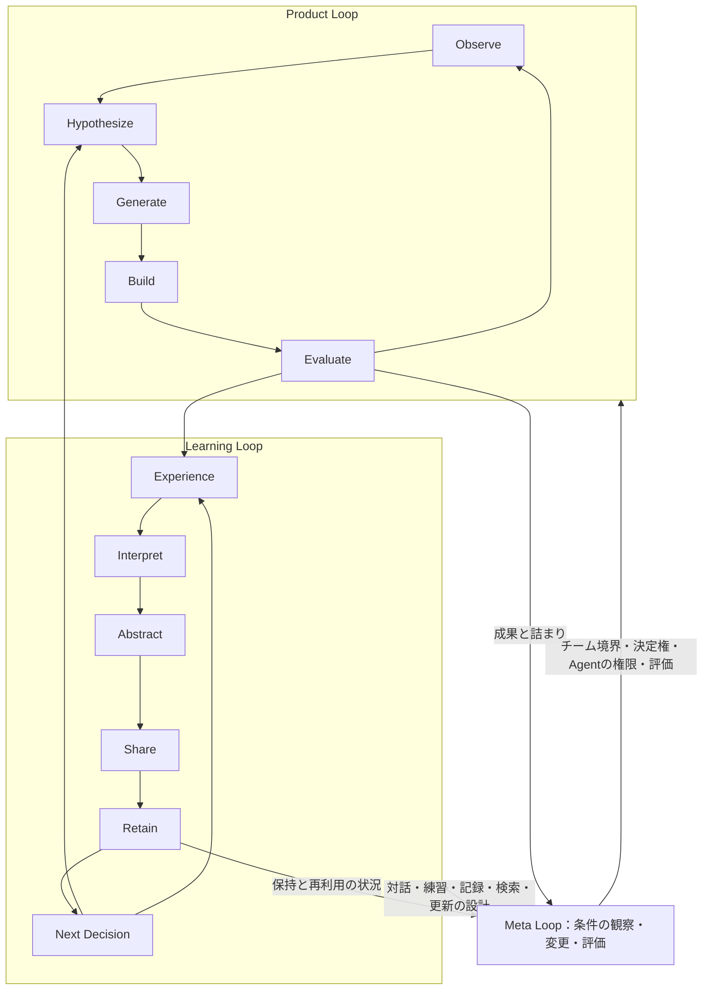

# AI時代、創造性のループをどう設計するか

## Krebs Cycle of Creativity、Team Topologies、組織学習、メタデザインを接続するための理論調査メモ

調査基準日：2026年9月2日。社内発表の発表者が、概念の由来、研究の射程、反論、未検証の部分を理解するためのノート。スライドの構成案ではない。

## 0. 調査から得られる暫定的な結論

今回の問題意識は、既存研究とかなりよく接続できる。ただし、**「AIで小さなチームの開発が速くなる」ことと、「人間・チーム・組織が学ぶ」ことを、別の成果として扱う必要がある。** また、境界を減らすことだけでなく、どの境界では協働し、どの境界では安定したサービスを利用し、どの知識を誰が保持するかが問題になる。

理論上の接続点は次の通りである。各主張の原典と留保は、対応する節で示す。

| 問い | 主に使う理論 | そこからは直接いえないこと |
|---|---|---|
| 異なる営みの往復から何が生まれるか | OxmanのKrebs Cycle of Creativity（第1節） | 四領域を通れば創造性が必ず高まる |
| 行動の修正と、目的・前提の修正はどう違うか | Argyris／Schön（第2節） | Product／Learning／Metaがsingle／double／deuteroと一対一に対応する |
| どこで協働し、どこで依存関係を安定させるか | Team Topologies（第3節） | 全員が全専門を担うチームが理想である |
| 専門境界で何が起きるか | Carlile、Star／Griesemer、Dougherty、Bechky（第4–5節） | 情報量を増やせば意味や利害の違いも解消する |
| 経験が次の判断に残る条件は何か | 4I、TMS、shared mental model、organizational memory（第2・6節） | ログや要約を保存すれば組織学習が完了する |
| 生成の条件自体をどう変えるか | Fischer／Giaccardiほかのmetadesign（第7節） | 管理者によるワークフロー最適化だけで十分である |
| AIが支援した成果と人間の学習は一致するか | 実務・教育・プログラミングの近年研究（第8節） | AI支援の効果を自律Agentや長期の組織能力にそのまま一般化できる |

本メモの中心的な提案は、**成果物、判断能力、両者を生む仕組みを、それぞれ別に観察しながら結び直すこと**である。これは以下の理論を接続した作業モデルであり、既存の単一理論の名称ではない。

### 0.1 三つのloopの作業定義

| Loop | 主に更新するもの | 循環 | 「回った」と判断する手がかり |
|---|---|---|---|
| Product Loop | 問題仮説、解決案、実装、提供する価値 | Observe → Hypothesize → Generate → Build → Evaluate → Observe | 利用・運用からの観察が、次の仮説や実装を変えた |
| Learning Loop | 人間の理解・技能、チームの知識、組織の判断資源 | Experience → Interpret → Abstract → Share → Retain → Next Decision | 経験が取り出せる形になり、別の機会の判断・行動に使われた |
| Meta Loop | 上記二つを成立させる組織・技術・制度 | Loopの働きを観察 → 詰まりや偏りを解釈 → 条件を変更 → 効果を評価 | チーム境界、意思決定権、Agentの権限、評価、学習方法などが見直された |

次の図は**本メモ独自の整理**であり、OxmanやArgyris／Schönの原図ではない。

「局所的にloopを閉じる」とは、**結果を観察した単位に、仮説や実装を修正する能力と権限があること**と定義する。外部の顧客、専門家、プラットフォームから切り離すことではない。また、この図は思考の補助であり、全段階を毎回この順に実行する手順書ではない。

### 0.2 混同しない三つの軸

| 軸 | 区別 | 例 |
|---|---|---|
| 更新対象 | Product／Learning／Meta | 実装を変える、理解を変える、意思決定制度を変える |
| 変更の深さ | single-loop／double-loop | 同じ成功基準で手段を改善する、その成功基準自体を問い直す |
| 学習の所在 | 個人／チーム／組織 | 自分ができる、互いの知識を使える、担当交代後も判断が再現される |

たとえば、Product Loopで「処理速度が成功指標」という前提を疑う行為はdouble-loopになり得る。逆に、Meta Loopで会議の所要時間だけを短くする行為はsingle-loopにとどまり得る。**名前にMetaが付いたから深い学習になった、とは判定できない。**

### 0.3 原典の確認範囲と読み方

各項目は「原典・主張・適用範囲・一致・相違・引用上の注意」で整理する。「一致」「相違」および具体的な開発への応用は、本メモによる解釈である。

- **本文確認**：原著の本文または該当章・節を確認した。全書籍を通読したという意味ではない。
- **原著要旨確認**：著者・出版社が公開する原論文の要旨を確認した。細かな方法・機序・効果量まで確認済みとは扱わない。
- **著者解説確認**：著者自身の公式説明を利用した。実務フレームワークと実証研究は区別する。
- **歴史の紹介**：後年の論文が整理した系譜は、その整理として示す。古い文献を直接読んだことにはしない。

対象を絞った理論調査であり、全関連文献を網羅する系統的レビューではない。実証研究、概念モデル、実務上の提案、今回の仮説を同じ証拠強度で扱わない。

## 1. Neri OxmanのKrebs Cycle of Creativity

### 1.1 原典と正確な意味

- **原典**：Neri Oxman（2016）, “Age of Entanglement,” *Journal of Design and Science*, 2016年1月13日。[原文・図](https://jods.mitpress.mit.edu/pub/ageofentanglement/release/1)、[DOI](https://doi.org/10.21428/7e0583ad)。本文確認。創造性についての概念的エッセイである。
- **主張**：Science、Engineering、Design、Artを、互いの成果を別の形へ変える営みとして循環的に置く。生化学のKrebs cycleはその比喩であり、創造活動のエネルギーを定量測定したモデルではない。
- **適用範囲**：研究・制作・設計が専門の区分を横断するあり方を考えるための概念図。組織の人員配置や開発手順を直接規定するものではない。
- **今回との一致**：一つの営みの出力が、別の営みの入力となり、再解釈を通じて次の問いを生むという見方。個人や一つのプロジェクトが複数領域にまたがる可能性も含む。
- **今回との相違**：Product Loopの六工程、組織のLearning Loop、Agentの役割は原典にはない。四領域と「要求・要件・設計・実装」を対応させることにも根拠はない。
- **引用上の注意**：「Oxmanが循環型開発の優位性を実証した」とはいわない。原典では逆向きの移動、停止、変形、領域の省略も許される。四工程を一方向に必ず一周するモデルとして引用しない。

原典の変換関係を簡略化すると次のようになる。

| 営み | 主な変換 | 読み取るべき点 |
|---|---|---|
| Science | information → knowledge | 世界について説明・予測する |
| Engineering | knowledge → utility | 知識を実用的な働きへ変える |
| Design | utility → behavior | 人間との関係や経験を形づくる |
| Art | behavior → 新たなinformationの知覚 | 世界の見方を変え、新しい問いを開く |

この表も原図の要約であり、四つの固定的な職種の定義ではない。原典はこれをantidisciplinaryな仮説として提示している。[Oxman原文](https://jods.mitpress.mit.edu/pub/ageofentanglement/release/1)

原図には、北のperceptionと南のproduction、東のnatureと西のcultureという軸もある。これらは営みの関係を読むための軸であり、四つの組織部門を描いたものではない。創造のエネルギーをCreATPと呼ぶ表現も比喩として読む。[同原典](https://jods.mitpress.mit.edu/pub/ageofentanglement/release/1)

### 1.2 今回の発表で担わせる役割

KCCは、領域をまたぐ往復に目を向ける**入口の比喩**として有効である。しかし、「なぜ境界で意味が変わるか」はCarlileやBechky、「なぜ経験が組織に残らないか」はArgyris／Schönや4Iで説明した方がよい。KCCの美しい図を、その後の組織論の証明に使わないことが大切である。

## 2. Argyris／Schönと組織学習

### 2.1 Single-loop learning

- **原典**：Chris Argyris（1976）, “Single-Loop and Double-Loop Models in Research on Decision Making,” *Administrative Science Quarterly*, 21(3), 363–375。[DOI](https://doi.org/10.2307/2391848)。Chris Argyris & Donald A. Schön（1978）, *Organizational Learning: A Theory of Action Perspective*, Addison-Wesley。定義の読解には両著者（1996）, *Organizational Learning II: Theory, Method, and Practice*, 第1章、特にpp.20–21を使用した。1996年版の該当本文確認。
- **主張**：誤りや期待との差を検知し、既存のgoverning valuesを保ったまま行動方略を修正する学習。
- **適用範囲**：個人・組織の行動を導くtheory-in-useと、結果に応じた修正の関係。
- **今回との一致**：既存の目標に向け、観察・実装・評価を繰り返すProduct Loopの多くを説明できる。
- **今回との相違**：single-loopは「学習していない」「単なる自動化」を意味しない。判断に必要な技能や知識の改善も、価値基準を変えなければsingle-loopであり得る。
- **引用上の注意**：「前提は何も変えない」と単純化しすぎない。1996年の説明では、行動方略やその下の仮定は変更できる。維持されるのは、それらを支配する価値・基準である。

**本メモの例**：「CSV出力は30秒以内」という基準を保ちながら、クエリを改善する。性能の原因理解も深まるならProductとLearningの双方が動くが、変更の深さはsingle-loopである。

### 2.2 Double-loop learning

- **原典**：上記Argyris（1976）、Argyris & Schön（1978／1996）。1996年版pp.20–22の定義を参照。
- **主張**：結果の不一致を受け、行動方略だけでなく、その方略を支配する価値・規範・目的の妥当性も問い直す。
- **適用範囲**：掲げている理念だけでなく、実際の行動を支配しているtheory-in-useの変更。本人の宣言であるespoused theoryとは分けて考える。
- **今回との一致**：評価指標、要求の解釈、決定権の置き方まで見直すMeta Loopを考える基礎になる。
- **今回との相違**：double-loopは必ずMeta Loopに限定されない。顧客観察から「そもそも何を成功とするか」を変えるProduct Loopにも起こる。
- **引用上の注意**：「なぜ」を二回聞く手法でも、振り返り会を開くことでもない。問い直しによって何の規範が変わったかを示す。常にsingle-loopより望ましいという序列にもならない。

**本メモの例**：「速い出力」が本当に顧客の成功なのかを問い、実際には「毎朝の照合作業を不要にすること」が必要だと気づく。ここでは、解く問題と評価基準の変更が重要であり、改善会議の回数は判定基準にならない。

### 2.3 Deutero-learning

- **原典**：Argyris & Schön（1978）および（1996）, *Organizational Learning II*, 第1章、特にpp.28–29。後者の該当本文確認。著者らはBatesonのdeutero-learningに言及し、組織における「学び方を学ぶ」ことを論じる。Batesonの原著全体を直接調査した項目ではない。
- **主張**：過去の学習経験を吟味し、何が学習を助け、妨げるかを学び、組織のlearning systemを変える。
- **適用範囲**：探究の手順、情報経路、インセンティブ、対人関係、防衛的な行動など、学習が起きる条件。
- **今回との一致**：Learning Loopの断絶を観察し、記録・対話・評価・権限を設計し直すというMeta Loopに、最も直接的に接続する。
- **今回との相違**：Meta Loopには、計算資源の配分など学習システムの変更とは限らない活動も含めている。したがって完全な同義ではない。
- **引用上の注意**：1996年p.29では、学習システムを変えることを組織的double-loop learningの重要な一種として位置づける。**single → double → deuteroという「一重・二重・三重」の固定階層にはしない。** 「triple-loop」と無条件に言い換えない。

以上の読解は1996年版第1章による（ISBN 0-201-62983-6）。本文確認には[原著の公開テキスト](https://www.scribd.com/document/1009321987/Argyris-og-Scho-n-1996)を用いた。発表で逐語引用する場合は、手元の同版の紙面と照合する。

同書のlearning systemには、情報経路や手順などの構造だけでなく、信頼・防衛・利害や権力をめぐる、実際の相互作用のあり方も含まれる（pp.28–29）。今回への含意は、記録様式や会議を整えても、誤りを表明できない関係が残れば十分ではない、ということである。Meta Loopをツールや手順の改善だけに狭めない方がよい。

### 2.4 Kolbのexperiential learning

- **原典**：David A. Kolb（1984）, *Experiential Learning: Experience as the Source of Learning and Development*, Prentice-Hall。[著者団体による第2章の公開](https://learningfromexperience.com/research-library/the-process-of-experiential-learning/)。概念の本文確認には、Kolb・Boyatzis・Mainemelisによる[後続の著者稿（1999年8月31日付）](https://learningfromexperience.com/downloads/research-library/experiential-learning-theory.pdf)、pp.2–3も用いた。
- **主張**：具体的経験、内省的観察、抽象的概念化、能動的実験の関係を通じ、経験が知識へ変換されると捉える。
- **適用範囲**：経験と内省・概念・実践の関係を理解する学習モデル。
- **今回との一致**：作業の実施と、経験の解釈・抽象化・次の試行を区別する根拠になる。
- **今回との相違**：Shareや組織的Retainを含む今回の六段階はKolbの原モデルではない。個人の経験学習を、組織の制度化まで延ばすには別の理論が要る。
- **引用上の注意**：固定的な学習者タイプの判定や、全学習が四段階を同じ順序で進むという主張に広げない。本メモは経験の変換という観点を借りる。

### 2.5 Crossan／Lane／Whiteの4I framework

- **原典**：Mary M. Crossan, Henry W. Lane & Roderick E. White（1999）, “An Organizational Learning Framework: From Intuition to Institution,” *Academy of Management Review*, 24(3), 522–537。[DOI・原著要旨](https://doi.org/10.5465/amr.1999.2202135)、[著者公開の本文](https://www.researchgate.net/publication/239063020_An_Organization_Learning_Framework_From_Intuition_to_Institution)。定義・レベル間の関係の該当本文確認。
- **主張**：intuiting、interpreting、integrating、institutionalizingという四過程を、個人・集団・組織の水準にまたがって捉える。新しい理解が制度へ向かう流れと、制度が現場へ作用する流れの両方を扱う。
- **適用範囲**：企業の更新を説明する組織学習の概念モデル。
- **今回との一致**：個人が発見しただけでは組織学習にならず、共同の行動や制度に埋め込まれる過程が必要だと説明できる。
- **今回との相違**：今回の六段階は4Iの言い換えではない。共有ファイルへの保存をinstitutionalizingと呼ぶだけでは不十分である。
- **引用上の注意**：全過程が全水準で同じように起きるモデルではない。直観は個人に、制度化は組織に位置づけられ、解釈・統合が水準をつなぐ。図を一直線の知識移管に還元しない。

**今回への接続**：Agentが検知した不具合を本人が理解すること、チームが対処できること、次の担当者にも適用されるテストや判断規則に変わることは、別々の達成である。しかも制度化したルールが、後の観察を狭める方向に働くことも考えなければならない。

## 3. Team Topologies：境界とinteractionをどう設計するか

### 3.1 理論・実務上の位置づけ

- **原典**：Matthew Skelton & Manuel Pais（2019）, *Team Topologies: Organizing Business and Technology Teams for Fast Flow*, IT Revolution。2025年に第2版。[著者公式の書籍情報](https://teamtopologies.com/book)、[Key Concepts](https://teamtopologies.com/key-concepts)。本メモは著者公式の定義を確認しており、書籍全体を通読したものではない。
- **主張**：価値の流れとチームの認知負荷を重視し、四つのチーム類型と三つのinteraction modeを使って、組織を継続的に調整する。
- **適用範囲**：主として技術を使った事業・ソフトウェア提供のチーム設計。経験を整理した実務フレームワークであり、四分類の普遍性を実験的に証明した理論ではない。
- **今回との一致**：価値の流れに沿う単位が、必要な専門性を持ち、結果に責任を持つ設計。学習支援と共通能力の提供を別の役割として扱える点も重要である。
- **今回との相違**：すべての能力を各チームに抱え込ませない。意図的な境界、専門チーム、内部プラットフォームが成立条件に入る。
- **引用上の注意**：組織図に四種類のラベルを付けるだけで導入したとはいえない。チームのタイプとinteraction modeは別の軸であり、一対一対応でも固定的な序列でもない。

### 3.2 四つのteam type

以下の定義は著者公式説明の要約。「今回の読み方」は本メモの応用である。[公式Key Concepts](https://teamtopologies.com/key-concepts)

| タイプ | 原義の要点 | 今回の読み方・誤読の回避 |
|---|---|---|
| Stream-aligned Team | 一つの価値・仕事の流れに沿い、継続的な提供を担う | Product Loopの主体の候補。ただしチーム内に全専門家を常設することとは違う |
| Enabling Team | 能力上の不足を見つけ、他チームが自立して進めるよう支援する | Learning Loopを支える。成果物を永続的に代行するだけなら、能力移転は起こらない |
| Platform Team | 他チームの負荷を下げる、使いやすい内部の製品・サービスを提供する | 少人数の活動を共通基盤で支える。利用するたびの個別依頼や待ち行列が増えるなら検討が必要 |
| Complicated Subsystem Team | 深い専門性を要するサブシステムを担う | 専門知識の集約が合理的な場合を残す。「難しい仕事は全部ここへ」という分類ではない |

現在の公式説明では、platformを他のチームタイプから成る**グループ**としても表現している。「一枚の組織図に必ず四チームを置く」という解釈は避ける。

### 3.3 三つのinteraction mode

| モード | 原義の要点 | 今回の設計上の問い |
|---|---|---|
| Collaboration | 一定期間、密に共同して発見・解決する | 境界や要求がまだ不確かな間、誰と何を一緒に確かめるか |
| X-as-a-Service | 定義されたサービスを利用・提供する | 何を安定した契約として扱い、どんな変更時に再協議するか |
| Facilitation | 他チームが障害を越え、能力を獲得するのを助ける | 支援終了後に相手が何を自力でできるようになるか |

共同作業を永続化すると調整負荷が高くなり得る。他方、まだ意味や利害が合意されていない段階でサービス契約だけにすると、問い合わせと手戻りが増え得る。**interaction modeを、問題の成熟度に応じて変更する**ことが今回の重要な応用になる。[著者によるモデルの使い方](https://teamtopologies.com/how-to-use-shapes)

Agentにも同様の問いを適用できる。ただし「Agent＝Enabling Team」などと同一視はしない。Agentが納品を代行しているのか、人間の理解と自立を支えているのかを、実際の結果で判定する。

## 4. Boundary spanning、knowledge boundaries、interdisciplinary collaboration

### 4.1 Carlile：transfer／translation／transformation

- **原典**：Paul R. Carlile（2002）, “A Pragmatic View of Knowledge and Boundaries: Boundary Objects in New Product Development,” *Organization Science*, 13(4), 442–455。[DOI](https://doi.org/10.1287/orsc.13.4.442.2953)。Carlile（2004）, “Transferring, Translating, and Transforming: An Integrative Framework for Managing Knowledge Across Boundaries,” 同誌15(5), 555–568。[DOI](https://doi.org/10.1287/orsc.1040.0094)、[著者公開本文](https://people.bu.edu/carlile/docs/3-T%20Framework%20%28Carlile%29.pdf)。主に2004年論文の本文確認。
- **主張**：専門間の知識のdifference、dependence、noveltyに着目し、構文的・意味的・実践的な境界で必要な対応を区別する。
- **適用範囲**：新製品開発など、異なる専門家の知識が相互依存する場面。
- **今回との一致**：境界越えを、同じ内容の単なる搬送として扱えない点。利害や既存の投資まで関わると、翻訳だけでは問題が解けない。
- **今回との相違**：すべての境界が常に意味を大きく変えるわけではない。共有された語彙と安定した関係があればtransferで足りる場合もある。
- **引用上の注意**：三つを毎回順番に通る成熟段階にしない。transformationは文書形式の変換ではなく、知識・実践・利害を調整して変更することを含む。

| 境界 | 問題の性質 | 対応 | 本メモの例 |
|---|---|---|---|
| Syntactic | 共通の表現・語彙が必要 | Transfer | 同じ「処理完了時刻」を同じデータ型で渡す |
| Semantic | 同じ表現でも意味づけが異なる | Translation | 「完了」が、サーバー処理終了か、利用者の確認終了かを合わせる |
| Pragmatic | 一方の変更が他方の仕事や利害を変える | Transformation | 高速化のための非同期化が、顧客対応・運用責任・費用配分を変えるため協議する |

分類はCarlile、右列の例は本メモによる。[Carlile（2004）](https://doi.org/10.1287/orsc.1040.0094)

**AIへの応用仮説**：LLMは用語の対応、説明の書き換え、表現の試作を助ける可能性がある。しかし、それだけで責任分担や費用負担への合意が成立するとはいえない。disciplinary transition costには、表現を理解する費用だけでなく、相手と行動を調整する費用も含める必要がある。

### 4.2 Star／Griesemer：boundary objects

- **原典**：Susan Leigh Star & James R. Griesemer（1989）, “Institutional Ecology, ‘Translations’ and Boundary Objects: Amateurs and Professionals in Berkeley’s Museum of Vertebrate Zoology, 1907–39,” *Social Studies of Science*, 19(3), 387–420。[DOI](https://doi.org/10.1177/030631289019003001)、[原著本文](https://criticalmanagement.uniud.it/fileadmin/user_upload/documents/Star__Griesemer_1989.pdf)。本文確認。
- **主張**：異なる社会的世界の参加者は、各々の用途に適応でき、共通の同一性も保つ対象を介して協働できる。完全な合意は協働の必須条件ではない。
- **適用範囲**：博物館の科学者・収集者など、異質な参加者の協働を分析した研究。
- **今回との一致**：仕様書、試作品、データ例などが、複数の専門世界をつなぐ媒体になる可能性を説明できる。
- **今回との相違**：専門差を消したり、全員の解釈を一つに統一したりする理論ではない。
- **引用上の注意**：共有フォルダに置かれた資料は、何でもboundary objectになるわけではない。異なる実践の間で、実際にどう使われ、協働を成立させているかを見る。

**今回への接続**：自然言語による一枚の「正解の要約」を作るより、利用者の具体例、実行可能な試作品、品質基準を組み合わせ、異なる観点から確かめられる方がよい場面がある。これはboundary objectの考え方を用いた設計案である。

### 4.3 Dougherty：interpretive barriersとthought worlds

- **原典**：Deborah Dougherty（1992）, “Interpretive Barriers to Successful Product Innovation in Large Firms,” *Organization Science*, 3(2), 179–202。[原著要旨・DOI](https://doi.org/10.1287/orsc.3.2.179)。原著要旨確認。
- **主張**：部門ごとに異なるthought worldsと組織の製品開発ルーティンが、技術と市場の理解を統合する障壁になる。
- **適用範囲**：大企業の製品イノベーションにおける部門間の理解。
- **今回との一致**：同じ情報を受け取っても、何を重要とみなすか、何を問題と捉えるかが異なるという説明になる。
- **今回との相違**：少人数化そのものを解決策として実証した研究ではない。職種を同席させても、解釈の障壁は残り得る。
- **引用上の注意**：部門の人々が無理解・非協力的だという性格論にしない。専門的実践から生じる合理性の違いとして扱う。要旨確認のため細かなケース比較は本メモでは断定しない。

### 4.4 Bechky：実践を通じた理解の変換

- **原典**：Beth A. Bechky（2003）, “Sharing Meaning Across Occupational Communities: The Transformation of Understanding on a Production Floor,” *Organization Science*, 14(3), 312–330。[DOI](https://doi.org/10.1287/orsc.14.3.312.15162)、[原著本文](https://www.dourish.com/classes/ics235aw05/readings/Bechky-SharingMeaning-OrgSci.pdf)。本文確認。
- **主張**：製造現場のエンジニア、技術員（technicians）、組立担当者の理解は、それぞれの言語・実践・仕事の位置に依存する。具体物や問題を介したやり取りから、理解そのものが変わり得る。
- **適用範囲**：生産現場の職業共同体間の相互作用を扱う質的研究。
- **今回との一致**：境界を越えると情報が減るだけでなく、相手の実践に接することで新たな理解が生成されるという説明になる。
- **今回との相違**：すべての暗黙的知識が文章化・LLM化できることを示す研究ではない。
- **引用上の注意**：生産現場の観察を、デジタル開発にも同じ効果量で当てはまる法則にしない。「変形」は必ずしも劣化ではなく、生産的な学習にもなり得る。

### 4.5 Ancona／Caldwell：boundary spanning

- **原典**：Deborah G. Ancona & David F. Caldwell（1992）, “Bridging the Boundary: External Activity and Performance in Organizational Teams,” *Administrative Science Quarterly*, 37(4), 634–665。[DOI](https://doi.org/10.2307/2393475)、[MIT公開の原著本文](https://web.mit.edu/curhan/www/docs/Articles/15341_Readings/Group_Dynamics/Ancona_Caldwell_1992_Bridging_the_boundary.pdf)。本文確認。
- **主張**：チームの成果を理解するには、内部の相互作用だけでなく、上位者への働きかけ、他部門との調整、技術・市場の探索など、外向きの活動も見る必要がある。
- **適用範囲**：実際の新製品開発チームにおける外部活動と成果の研究。
- **今回との一致**：隣接専門領域へつなぐ行為自体を、チームの仕事として設計すべきだと説明できる。
- **今回との相違**：「チーム内でloopを閉じるほどよい」という無条件の命題には反する。外部から切り離されたチームは必要な資源や観察を得られない。
- **引用上の注意**：外部との接触は量だけでなく内容・組み合わせが問題になる。常時の会議増加を正当化する研究ではない。

### 4.6 Cross-functionalとinterdisciplinaryを区別する

本メモでは、cross-functionalを「異なる職能が仕事の単位に参加していること」、interdisciplinaryを「異なる専門の概念・方法・判断基準を関係づけて問題を解くこと」と区別して用いる。これは読解のための作業上の区別であり、文献全体の統一定義を主張するものではない。

営業、デザイン、開発が同じチームにいても、成果物を順に渡しているだけなら、実態としてhandoffが残る。逆に、別チームであっても、具体的な問題を一緒に検証し、相互に判断を修正していれば、深い協働が成立する可能性がある。したがって、組織図の人数・職種だけではloopの閉じ方を評価できない。

## 5. Handoffで生じる情報・意味の変形をどう説明するか

### 5.1 Galbraith：組織のinformation processing

- **原典**：Jay R. Galbraith（1974）, “Organization Design: An Information Processing View,” *Interfaces*, 4(3), 28–36。[原著要旨・DOI](https://doi.org/10.1287/inte.4.3.28)。原著要旨確認。
- **主張**：仕事の不確実性、認知能力の限界、組織構造を結びつけ、情報システムや集団での問題解決を組織設計として考える。
- **適用範囲**：不確実な仕事に必要な情報処理と組織の形の関係。
- **今回との一致**：専門境界の数だけでなく、そこで処理しなければならない情報や調整の量を見る視点を与える。
- **今回との相違**：より多く情報交換すれば常によい、とは限らない。組織の認知上の限界がある。
- **引用上の注意**：この枠組みだけでは、情報の意味や利害の変換を十分に説明できない。Carlileやsensemakingと併せて使う。

### 5.2 Daft／Lengel：uncertaintyとequivocality

- **原典**：Richard L. Daft & Robert H. Lengel（1986）, “Organizational Information Requirements, Media Richness and Structural Design,” *Management Science*, 32(5), 554–571。[原著要旨・DOI](https://doi.org/10.1287/mnsc.32.5.554)。原著要旨確認。
- **主張**：情報が足りないuncertaintyと、解釈が定まらないequivocalityを区別する。必要なのは情報量の増加だけでなく、曖昧な状況の明確化でもある。
- **適用範囲**：仕事や部門間関係に適した情報処理手段・組織構造の検討。
- **今回との一致**：長い仕様書や大量のログだけでは、専門間の意味のずれを解けないと説明できる。
- **今回との相違**：対面、チャット、文書などの媒体を、今回の仕事と無関係に優劣づける根拠にはならない。
- **引用上の注意**：LLMが流暢に応答することと、当事者間で意味が共有されたことを混同しない。人間と対話できる形式だけでequivocalityの解消を判定しない。

### 5.3 Weick／Sutcliffe／Obstfeld：sensemaking

- **原典**：Karl E. Weick, Kathleen M. Sutcliffe & David Obstfeld（2005）, “Organizing and the Process of Sensemaking,” *Organization Science*, 16(4), 409–421。[原著要旨・DOI](https://doi.org/10.1287/orsc.1050.0133)。原著要旨確認。
- **主張**：出来事を、言葉で表現でき、行動を導く状況として意味づける過程が、組織化に関わる。
- **適用範囲**：不明確な出来事を、組織の人々が理解・行動可能な形にする過程。
- **今回との一致**：観察から要求や要件が生まれる段階ですでに解釈が働く。「生の要求をそのまま実装へ運ぶ」という想定を問い直せる。
- **今回との相違**：意味づけの成立と、世界についての説明の正しさは同一ではない。納得できる説明ができても仮説検証は必要である。
- **引用上の注意**：「事実など存在せず、すべて好きに解釈できる」という相対主義にしない。観測の証拠と、そこに付した意味を区別して記録する、という応用が有用である。

### 5.4 Shannonの情報理論をどこまで使えるか

- **原典**：Claude E. Shannon（1948）, “A Mathematical Theory of Communication,” *Bell System Technical Journal*, 27, 379–423, 623–656。[原著本文](https://people.math.harvard.edu/~ctm/home/text/others/shannon/entropy/entropy.pdf)。冒頭の問題設定を本文確認。
- **主張**：可能なメッセージ集合、通信路、雑音などを用いて通信を数学的に扱う。その工学的問題設定では、メッセージの意味は対象から切り離される。
- **適用範囲**：信号の伝送・符号化など。組織の合意、知識の価値、解釈の正しさを直接測る理論ではない。
- **今回との一致**：通信容量や圧縮という視点を、限定した比喩として使うことはできる。
- **今回との相違**：専門間で何が重要と判断されるか、意図がどう変わるかは、情報量だけでは説明できない。
- **引用上の注意**：「handoffのたびに意味が一定割合で失われる」「LLMは情報エントロピーを下げるから理解を改善する」といった説明を、測定や別の論証なしに行わない。

### 5.5 Selection／compression／translation／interpretationの作業上の分解

以下は単一の既存理論の分類ではなく、第4–5節を接続した**本メモの分析用語**である。現実の一つの発話では、複数が同時に起きる。

| 操作 | 何が起きるか | CSV出力の架空例 | 改善につながる場合／問題になる場合 |
|---|---|---|---|
| Selection | 何を取り上げるかを選ぶ | 顧客の不満から「出力が遅い」を課題にする | 問題を絞れる／本当は照合作業が負担だったことを落とす |
| Compression | 扱える粒度に要約・抽象化する | 利用状況を「100万行・30秒以内」にまとめる | 検証条件を共有できる／例外や利用頻度を消してしまう |
| Translation | 専門ごとの表現・関心に対応づける | 「待ちたくない」を非同期処理と通知機能に置き換える | 解決案が具体化する／利用者が必要としない複雑さを加える |
| Interpretation | 出来事や要望に意味を与える | 遅さを「DBの性能不足」と捉える | 原因仮説を作れる／裏付けなく技術問題と決めつける |
| Negotiated transformation | 依存関係や利害も含めて実践を変える | 即時応答の約束や運用責任を見直す | 持続可能な提供形態になる／一部の都合を他者に押しつける |

問いは「何文字失われたか」だけではなく、**何が選ばれ、どの仮定が付加され、誰の判断が変わったか**である。元の発話、要約、要件、評価結果を参照可能にしておくのは、この変換を検証するためである。全情報の丸ごと伝送を目標にする必要はない。

## 6. チームはどのように知識を保持するか

### 6.1 Transactive Memory System（TMS）

- **原典**：Daniel M. Wegner（1987）, “Transactive Memory: A Contemporary Analysis of the Group Mind,” in Mullen & Goethals, *Theories of Group Behavior*, pp.185–208。[原著章・DOI](https://doi.org/10.1007/978-1-4612-4634-3_9)。測定研究はKyle Lewis（2003）, “Measuring Transactive Memory Systems in the Field: Scale Development and Validation,” *Journal of Applied Psychology*, 88(4), 587–604。[DOI](https://doi.org/10.1037/0021-9010.88.4.587)、[原著要旨](https://pubmed.ncbi.nlm.nih.gov/12940401/)。Wegnerは書誌・公開プレビュー、Lewisは公開された原著本文の概念・尺度部分を確認。
- **主張**：メンバーが異なる知識を持つことに加え、誰が何を知っているかを把握し、互いの知識を信頼して組み合わせる。Lewisはspecialization、credibility、coordinationという側面を測定する。
- **適用範囲**：共同作業における知識の分担と協調。単なる個人の記憶容量の合計ではない。
- **今回との一致**：小さなチームが全知識を全員で暗記しなくても、専門性へのアクセスと組み合わせで機能し得る。
- **今回との相違**：TMSの成立には、情報の保存場所だけでなく、所在についての理解、信頼の妥当性、利用の協調が必要である。
- **引用上の注意**：「Agentを一人加えたらTMSが増強された」と即断しない。AIの専門性や信頼性がどの範囲で成立するかを、人間同士の研究から直接保証することはできない。

**今回への接続**：「このAgentに聞けばよい」という知識の索引は役に立ち得る。しかし、回答できない範囲、参照資料の期限、代替の確認先まで分かって初めて、較正された依存になる。これはTMSを人間とAIの協働へ拡張する設計仮説である。

### 6.2 Shared mental model

- **原典**：John E. Mathieu, Tonia S. Heffner, Gerald F. Goodwin, Eduardo Salas & Janis A. Cannon-Bowers（2000）, “The Influence of Shared Mental Models on Team Process and Performance,” *Journal of Applied Psychology*, 85(2), 273–283。[DOI](https://doi.org/10.1037/0021-9010.85.2.273)、[原著要旨](https://pubmed.ncbi.nlm.nih.gov/10783543/)。原著要旨確認。概念の最初の命名論文という意味ではなく、代表的な原著実証研究として選定。
- **主張**：仕事やチームについてのmental modelの共有・整合が、協調過程と成果に関わる。
- **適用範囲**：同論文は大学生56組のペアによるフライトシミュレーション課題を用いた研究。
- **今回との一致**：目標、制約、役割、失敗時の対応が理解されていれば、逐一すべてを明文化して引き渡さなくても協働しやすい、という考え方に接続する。
- **今回との相違**：全員が同じ専門知識を持つという意味ではない。共有されていること自体から、そのモデルの正しさも保証されない。
- **引用上の注意**：この課題の結果を、企業の開発チームの最適人数に変換しない。合意の強さを成果そのものとして評価すると、誤った共通理解を見逃す。

TMSは主に**知識の分担と所在**、shared mental modelは主に**共同作業に必要な理解の整合**を見る。互いに補完できるが同義ではない。発表では「知識を共有する」という表現を、どちらの意味で使っているか明確にするとよい。

### 6.3 Walsh／Ungson：organizational memory

- **原典**：James P. Walsh & Gerardo Rivera Ungson（1991）, “Organizational Memory,” *Academy of Management Review*, 16(1), 57–91。[原著要旨・DOI](https://doi.org/10.5465/amr.1991.4278992)。要旨と、公開された原著本文の定義・保持に関する抜粋を確認。
- **主張**：組織の記憶を、情報のacquisition、retention、retrievalの過程として扱う。保持された過去の情報は意思決定に使われ得るが、誤用されることもある。
- **適用範囲**：組織が経験を保持・利用する仕組みを論じる概念的研究。
- **今回との一致**：Learning LoopにRetainだけでなくNext Decisionを置く理由になる。保存と取り出しと利用を分けて調べる必要がある。
- **今回との相違**：組織の記憶は、全員が頭の中で同じ内容を覚えることには限定されない。したがって「すべてのAgentの知識を全員へ戻す」ことは、必要条件として強すぎる。
- **引用上の注意**：組織を一人の人間のように擬人化しない。何が、どこに、誰によって保持され、どの判断で利用されたのかを具体化する。

**今回への接続**：判断文書、テスト、運用手順、組織の役割、検索可能な記録を合わせて、記憶の配置を調べる。Agentの外部メモリも保持先の候補だが、アクセス権、検索可能性、妥当性の更新、利用者が確認できる根拠がなければ、組織的に利用可能な記憶とは評価しにくい。

### 6.4 Cohen／Levinthal：absorptive capacity

- **原典**：Wesley M. Cohen & Daniel A. Levinthal（1990）, “Absorptive Capacity: A New Perspective on Learning and Innovation,” *Administrative Science Quarterly*, 35(1), 128–152。[原著本文](https://www.edegan.com/pdfs/Cohen%20Levinthal%20%281990%29%20-%20Absorptive%20Capacity.pdf)。本文確認。
- **主張**：外部知識の価値を認識し、取り込み、利用する能力は、既存の関連知識に依存する。組織の能力は、個人の能力を足し合わせただけでは捉えられない。
- **適用範囲**：企業の学習、R&D、外部知識の利用とイノベーション。
- **今回との一致**：隣接領域へ入るための足場となる知識を保つ必要を説明できる。専門性の多様さと、理解をつなぐ重なりの両方が問題になる。
- **今回との相違**：知識へ安くアクセスできるだけで、それを評価・統合する能力が得られるとはいえない。
- **引用上の注意**：LLMを扱った研究ではない。「基礎知識がなければAIを使うべきでない」という一律の結論にもならない。AIが足場を提供する可能性と、足場を失わせる可能性を分けて検証する。

### 6.5 「人間に戻す」を三段階に分ける

次の区分は以上を接続した本メモの提案である。

1. **個人が保持すべきもの**：異常の察知、根拠の評価、重要な失敗への対処など、任せるために必要な理解・技能。
2. **チームが保持すべきもの**：誰に何を聞けるか、どの根拠を信頼するか、例外をどう協議するか。
3. **外部化してよいもの**：詳細な参照情報、反復可能な処理、過去の記録。ただし取り出し・検証・更新の責任を決める。

具体的な分配はリスクと仕事による。組織学習のために全員の再実装を義務にするのも、検索できるから誰も理解しなくてよいとするのも、どちらも強すぎる。

## 7. Metadesignの定義・歴史と今回の用法

### 7.1 単一の定義・単一の起源を置かない

Metadesignには、設計を設計するという一般的な用法、デジタル環境での利用者参加、社会・倫理的な条件、持続可能性と社会変容など、重なり合う系譜がある。

| 時期 | 確認できる位置づけ | 出典と確実性 |
|---|---|---|
| 1960年代以降 | 「designing the design」という用法があったという後年の整理 | Giaccardi（2005）による歴史記述。最初の命名者・初出年は本調査では一次資料で確定していない |
| 1986年 | Youngbloodが電子メディア・文化の文脈でmetadesignを論じた | Giaccardi（2005）が紹介する系譜。Youngbloodの原文を直接確認した説明ではない |
| 1997年 | Maturanaが技術と人間の望み・責任を問い直す | 後述の本人によるエッセイを確認 |
| 2004–2006年 | Fischer／Giaccardiらがend-user development、共創、進化する社会・技術基盤として展開 | 2004年論文、2006年章の原著を確認 |
| 2013年 | Woodが環境・社会のパラダイム変化と協働の枠組みとして展開 | 本人公開の書籍章草稿を確認 |

1960年代やYoungbloodについての紹介は、以下のGiaccardiの歴史整理による。ここだけを根拠に「メタデザインの発明者」を断定しない。[Giaccardi（2005）原著](https://www.trans-techresearch.net/wp-content/uploads/2015/05/giaccardielisa.pdf)

### 7.2 Giaccardi：emergent design culture

- **原典**：Elisa Giaccardi（2005）, “Metadesign as an Emergent Design Culture,” *Leonardo*, 38(4), 342–349。[DOI](https://doi.org/10.1162/0024094054762098)、[本文](https://www.trans-techresearch.net/wp-content/uploads/2015/05/giaccardielisa.pdf)。本文確認。
- **主張**：情報技術によって広がる設計空間の中で、metadesignを複数の理論・実践が形づくる文化として捉え、創造過程の拡張を論じる。
- **適用範囲**：アート、文化理論、インタラクティブな設計実践などを横断する概念整理。
- **今回との一致**：成果物だけでなく、創造が続く場や関係を設計対象にする方向が一致する。
- **今回との相違**：企業のProduct／Learning Loopだけに限定される概念ではない。
- **引用上の注意**：この論文自体は原著の理論的論考だが、その中の古い文献の紹介は二次的な歴史記述である。両者を区別して引用する。

### 7.3 Fischer／Giaccardiら：end-user developmentのためのmetadesign

- **原典**：Gerhard Fischer, Elisa Giaccardi, Yunwen Ye, Alistair G. Sutcliffe & Nikolay Mehandjiev（2004）, “Meta-Design: A Manifesto for End-User Development,” *Communications of the ACM*, 47(9), 33–37。[DOI](https://doi.org/10.1145/1015864.1015884)、[著者稿](https://l3d.colorado.edu/wp-content/uploads/2011/09/CACM-meta-design.pdf)。Fischer & Giaccardi（2006）, “Meta-design: A Framework for the Future of End-User Development,” in *End User Development*, pp.427–457。[原著章](https://doi.org/10.1007/1-4020-5386-X_19)。2004年本文、2006年公開部分を確認。
- **主張**：利用者が使用時にも設計へ参加し、環境を拡張できるよう、社会的・技術的条件を作る。設計時点で未来の用途をすべて決め切らず、使用の中で進化できる余地を残す。
- **適用範囲**：利用者による変更、共創、継続的に進化するソフトウェアや学習・仕事の環境。
- **今回との一致**：成果物を生み続ける条件、知識、参加、技術基盤をまとめて設計する点で、今回の定義に最も近い。
- **今回との相違**：原著の中心には「問題の当事者が設計へ参加できること」がある。管理者やAgent設計者だけが仕組みを変えられる体制とは距離がある。
- **引用上の注意**：underdesignは手抜きではなく、後の変更を可能にする設計である。「全部自動生成する仕組み」だけで、この参加的な意味を代表させない。

原著のSeeding–Evolutionary Growth–Reseedingは、初期の足場、使用に伴う成長、蓄積を整理し直す局面を区別する。今回に引き寄せれば、Agentのルールや知識が増えた後に、矛盾・重複・陳腐化を見直す活動が重要になる。ただし、その具体的なAgent運用は本メモの応用である。[Fischerほか（2004）](https://doi.org/10.1145/1015864.1015884)、[Fischer／Giaccardi（2006）](https://doi.org/10.1007/1-4020-5386-X_19)

### 7.4 Maturana：何を望み、何を技術に委ねるか

- **原典**：Humberto Maturana（1997）, “Metadesign: Human Beings versus Machines, or Machines as Instruments of Human Designs?” 1997年8月1日付。[本人のエッセイ](https://www.inteco.cl/articulos-9)。本文確認。
- **主張**：技術や進歩をそれ自体の目的とせず、人間が何を望み、その望みにどう責任を持つかを問う。
- **適用範囲**：技術、人間、認知、共存についての哲学的・倫理的考察。
- **今回との一致**：生成・実装を加速する前に、誰の目的とどの生き方を支えるのかをMeta Loopで問う視点につながる。
- **今回との相違**：チーム編成や開発プロセスの効率を実証した理論ではない。
- **引用上の注意**：生物学や認知に関する議論から、特定の企業組織の優位性を直接導かない。本メモでは、目的を技術へ無自覚に委ねないための論点として使う。

### 7.5 Wood：持続可能性とパラダイム変化

- **原典**：John Wood（2013）, “Metadesigning Paradigm Change: an ecomimetic, language-centred approach,” in Stuart Walker & Jacques Giard（eds.）, *The Handbook of Design for Sustainability*, pp.428–445。[本人公開の章草稿](https://metadesigners.org/Metadesigning-Paradigm-Change-Overview)。本文確認。
- **主張**：孤立した製品改善を越え、言語、関係、行動、複数の変化を組み合わせて、パラダイムの変更を試みる自己省察的な協働を論じる。
- **適用範囲**：持続可能性と社会的な設計実践。
- **今回との一致**：多様な専門が協働し、自分たちの目的・ルールも問い直すという考え方。少人数の異質な協働チームも、すでに本人の議論に含まれる。
- **今回との相違**：目的は企業内の速度や生産性にとどまらず、生態系や社会の関係の変容に及ぶ。
- **引用上の注意**：この規範的・実践的提案を、「小チームの生産性が実証された」というデータとして扱わない。公開文書は刊行章の草稿である。

### 7.6 今回採用できる定義と、その限定

本発表では、次のように定義すると先行研究との接続が明瞭になる。

> **本メモの作業定義**：メタデザインとは、当事者が成果物・知識・判断を継続的に生み、その目的や作り方も問い直せるよう、社会的・技術的な条件と、それを更新する仕組みを設計することである。

ユーザーの当初の定義に「当事者」と「目的も問い直せる」を加えた。これによって、Fischer／Giaccardiの参加と、Maturana／Woodの目的・価値への問いを残せる。

| 今回の対象 | 既存のmetadesignとの関係 |
|---|---|
| チームの形、interface、共同作業のルール | 社会的な基盤を設計する考え方と重なる |
| Agentのツール・権限・停止条件・評価 | 技術基盤をAIへ具体化する今回の適用 |
| 知識を解釈・保持・再利用する仕組み | 仕事と学習の環境を結びつける先行研究と重なる |
| Product／Learning／Metaの三つに分ける | 本メモの分析上の構成。既存の標準的な三分類ではない |
| 生産性以外の価値、利用者による変更 | 広いmetadesignから落とさない方がよい論点 |

「生成する条件」と「何をよい成果と選ぶか」は別の設計対象である。前者だけを整えても、後者が誤っていれば、その誤りを大量に再生産し得る。Meta Loopはmetadesignを実践する一つの過程と位置づけられるが、両語を完全な同義語にする必要はない。

## 8. AIは人間の学習・技能形成・知識保持に何をもたらすか

### 8.0 まず、測っている成果を分ける

| 観測する成果 | 何が分かるか | それだけでは分からないこと |
|---|---|---|
| AIを使用中の速度・品質 | 支援込みの遂行能力 | 人間が単独でも理解・実行できるか |
| AIを外した直後の課題 | 直後の独立した遂行・転移 | 数週間・数か月後の保持 |
| 時間を空けた再テスト | 技能・知識の保持 | 別の仕事や組織全体への一般化 |
| 他メンバーによる説明・再利用 | チームへの伝達と利用可能性 | 制度として持続するか |
| 担当交代後の判断・運用 | 組織的な保持の一側面 | 因果的にAIが改善・悪化させたか |

以下の研究の多くは、チャット型支援やAIチューターを扱う。**長い自律実行、ツール操作、外部メモリを持つAgentが、企業の知識を数年単位でどう変えるかを直接調べた研究とは区別する。** 本調査で確認した研究だけから、その長期効果は確定できない。

### 8.1 The Cybernetic Teammate：専門境界を越える支援

- **原典**：Fabrizio Dell’Acquaほか（2025）, “The Cybernetic Teammate: A Field Experiment on Generative AI Reshaping Teamwork and Expertise,” NBER Working Paper 33641。[原著要旨・刊行情報](https://www.nber.org/papers/w33641)。要旨確認。working paperとして扱う。
- **主張・結果**：P&Gの専門職776人を対象とする無作為化実験。個人／二人チームとAIの有無を比較し、AIを使った個人が、AIなしのチームと同程度の評価を得た。AI利用時には、技術・商業の専門による提案内容の偏りも小さくなった。
- **適用範囲**：実務に関連する製品イノベーション提案課題。構想の評価であり、長期の開発・運用全体の比較ではない。
- **今回との一致**：AIが隣接領域の視点を取り込む助けになり、ある課題では少人数でもより広い仕事を扱える可能性を支持する。
- **今回との相違**：専門能力の長期獲得、組織的な記憶、チームの恒久的な置換を示したわけではない。
- **引用上の注意**：「AIで一人がチームと完全に等価になる」とはいわない。同程度の成績という報告を、あらゆる条件での統計的同等性や、Product Loop全体の完結の証明に拡大しない。

### 8.2 Generative AI at Work：学習を助ける可能性

- **原典**：Erik Brynjolfsson, Danielle Li & Lindsey R. Raymond（2025）, “Generative AI at Work,” *The Quarterly Journal of Economics*, 140(2), 889–942。[刊行論文](https://academic.oup.com/qje/article/140/2/889/7990658)、[DOI](https://doi.org/10.1093/qje/qjae044)。本文確認。古いworking paperの数値ではなく刊行版を使用。
- **主張・結果**：顧客サポート担当者5,172人への段階的導入を分析し、時間当たり解決件数は平均約15%増加した。経験の浅い担当者ほど恩恵が大きかった。AIが利用できない停止期間にも、過去の利用に伴う改善が残るという、学習と整合的な証拠も報告する。
- **適用範囲**：一企業の顧客サポート業務。導入時期の差を利用する分析であり、全員を無作為に割り付けた実験ではない。
- **今回との一致**：経験者の実践に接する支援が、初学者の実務遂行と学習を助ける可能性を示す。
- **今回との相違**：「AI利用は人間の学習を必ず失わせる」という命題には合わない。ProductとLearningの改善が両立する場合がある。
- **引用上の注意**：停止期間の結果を、無作為化された長期記憶テストと同一視しない。また論文中のsupport agentsは**人間の顧客サポート担当者**であり、自律型AI Agentではない。

### 8.3 Bastaniほか：解答支援と学習支援の違い

- **原典**：Hamsa Bastaniほか（2025）, “Generative AI without guardrails can harm learning: Evidence from high school mathematics,” *PNAS*, 122(26), e2422633122。[DOI](https://doi.org/10.1073/pnas.2422633122)、[著者公開本文](https://hamsabastani.github.io/education_llm.pdf)。本文確認。
- **主張・結果**：トルコの高校生約1,000人を対象に、通常に近いGPT Base、学習向けのGPT Tutor、AIなしを比較。AI利用中の練習成績は上がったが、GPT Base群はAIなしの試験で対照群より成績が低くなった。GPT Tutorはその悪影響を抑えた。
- **適用範囲**：高校数学の練習と、その後の支援なし試験を扱う無作為化実験。
- **今回との一致**：支援込みの成果が改善していても、独立した遂行能力が育たない場合がある。
- **今回との相違**：効果はAIの利用設計で異なる。学習向け支援まで一括して有害とはいえない。
- **引用上の注意**：GPT Baseの試験成績低下約17%は相対的な値であり、17パーセントポイントではない。GPT Tutorで悪影響がなくなったことを、支援なし試験の有意な向上と混同しない。長期保持の実験でもない。

GPT Tutorは、単に「理由を説明して」と付け加えたものではなく、教師が用意した解法・ヒントなどを使った設計である。2025年8月の[訂正](https://doi.org/10.1073/pnas.2518204122)は著者所属に関するもので、結果の変更ではないことを確認した。

### 8.4 Shen／Tamkin：新しいプログラミング技能の形成

- **原典**：Judy Hanwen Shen & Alex Tamkin（2026）, “How AI Impacts Skill Formation,” arXiv:2601.20245。[v2・2026年2月1日改訂](https://arxiv.org/abs/2601.20245v2)、[本文](https://arxiv.org/html/2601.20245v2)。本文確認。プレプリント。
- **主張・結果**：新しいPythonライブラリTrioを学ぶ無作為化実験。主分析52人で、AI支援群は支援なしの理解・デバッグ等の事後評価が低かった。差の大きさはCohen’s dで約0.74。一方、課題完了時間の群間差は統計的に有意ではなかった。
- **適用範囲**：限定されたライブラリの習得課題と直後の評価。チャット型支援であり、長期の実務や完全自律Agentの評価ではない。
- **今回との一致**：新しい領域の課題をAIで処理できても、確認・修正に必要な理解が育つとは限らない。
- **今回との相違**：認知的な関与を維持した利用者もいた。ただし利用パターンの分類は無作為割付ではなく、それ自体の因果効果は分からない。
- **引用上の注意**：「速くなった代わりに学ばなかった」と一括しない。この実験の速度差は有意ではない。主実験の人数52と、定性的分析に使える録画数51を混同しない。

### 8.5 Kestinほか：学習のために設計されたAIチューター

- **原典**：Greg Kestin, Kelly Miller, Anna Klales, Timothy Milbourne & Gregorio Ponti（2025）, “AI tutoring outperforms in-class active learning: an RCT introducing a novel research-based design in an authentic educational setting,” *Scientific Reports*, 15, 17458。[原著本文](https://www.nature.com/articles/s41598-025-97652-6)。本文確認。
- **主張・結果**：大学物理の受講者194人を対象とする無作為化クロスオーバー実験で、教育原則を取り入れたAIチューターの条件は、授業内のactive learningより直後の学習成績が高く、学習時間の中央値も短かった。
- **適用範囲**：二つの授業内容を対象に、設計された個別AI教材と教室活動を比較した実験。
- **今回との一致**：AIとのinteractionや課題の進め方を設計すれば、人間の理解を支援できる可能性がある。
- **今回との相違**：AIが課題を代行することと、学習者がAIチューターで学ぶことは異なる条件である。
- **引用上の注意**：比較されたのは、特定の教材・進行・フィードバックを含む教育介入である。任意のLLMが任意の教師に勝つという結論ではなく、長期保持も測っていない。

### 8.6 Leeほか：critical thinkingに関する自己申告

- **原典**：Hao-Ping（Hank）Leeほか（2025）, “The Impact of Generative AI on Critical Thinking: Self-Reported Reductions in Cognitive Effort and Confidence Effects From a Survey of Knowledge Workers,” *CHI 2025*。[DOI](https://doi.org/10.1145/3706598.3713778)、[著者公開本文](https://www.microsoft.com/en-us/research/wp-content/uploads/2025/01/lee_2025_ai_critical_thinking_survey.pdf)。本文確認。
- **主張・結果**：知識労働者319人、利用事例936件の調査。AIへの高い信頼は、自己申告の批判的思考の少なさと関連した。思考の対象が、情報の確認、出力の統合、仕事全体の管理へ移ることも報告された。
- **適用範囲**：知識労働者が自分のAI利用と認知的努力をどう認識しているか。
- **今回との一致**：生成を外部化した後にも、評価・統合・責任ある利用という仕事が残ることを示唆する。
- **今回との相違**：自己申告は、技能の客観的低下や長期の知識喪失そのものを測っていない。
- **引用上の注意**：「AIが知能を低下させたことを実証」と要約しない。無作為化実験ではなく、関連と当事者の認識を示す研究である。

### 8.7 Liuほか：支援を外した後のpersistence

- **原典**：Grace Liu, Brian Christian, Tsvetomira Dumbalska, Michiel A. Bakker & Rachit Dubey（2026）, “AI Assistance Reduces Persistence and Hurts Independent Performance,” arXiv:2604.04721。[v4・2026年8月5日改訂](https://arxiv.org/abs/2604.04721v4)。原著要旨・版を確認。プレプリント。
- **主張・結果**：数学的推論や読解等を対象とする複数の無作為化実験、合計1,222人で、AI利用中の成績向上に対し、その後の支援なし成績の低下と、課題を諦めやすくなる傾向を報告する。
- **適用範囲**：短いAI利用と、その直後の独立した課題遂行。
- **今回との一致**：Learning Loopでは知識量だけでなく、困難な課題へ自力で関与し続ける過程も見る必要がある。
- **今回との相違**：長期の職務能力、経験豊かな開発者、企業全体の学習を測ったものではない。
- **引用上の注意**：「即答への期待が形成されたから」という機序は著者の解釈・仮説と区別する。要旨の一般的なAI批判を、そのまま全モデル・全使用法の実証結果として引用しない。

### 8.8 METR：AIを使えば開発速度が上がる、という前提への反例

- **原典**：Joel Becker, Nate Rush, Elizabeth Barnes & David Rein（2025）, “Measuring the Impact of Early-2025 AI on Experienced Open-Source Developer Productivity,” arXiv:2507.09089。[原著要旨・v2](https://arxiv.org/abs/2507.09089v2)、[研究実施者の報告](https://metr.org/blog/2025-07-10-early-2025-ai-experienced-os-dev-study/)。要旨と実施者報告を確認。プレプリント。
- **主張・結果**：経験豊かな開発者16人が、よく知るOSSの246課題に取り組む実験で、課題ごとにAI利用可否を無作為化した。2025年前半のツールを使う条件では、完了時間が平均19%長くなった。
- **適用範囲**：成熟したコードベース、経験者、高い品質基準という特定条件。
- **今回との一致**：AI導入効果を生成時間だけでなく、レビュー・修正・統合を含めて測る必要を示す。
- **今回との相違**：AIが常にProduct Loopを高速化するという前提には合わない。また人間の学習を直接測った実験ではない。
- **引用上の注意**：2025年の結果を現在の全AIツールの性能としない。[2026年2月24日の追試報告](https://metr.org/blog/2026-02-24-uplift-update/)では、AIなし条件への参加回避などの選択バイアスと、並列作業の測定問題が説明され、現時点の効果を信頼できる形では推定できないとしている。

したがって、この研究の引用目的は「AIは遅い」という一般論ではなく、**特定の仕事で、支援の体感と実測が食い違うことがある**という反例の提示である。追試も、現在は確実に速くなったという証明として扱わない。

### 8.9 Bainbridge：自動化の逆説はLLM以前からある

- **原典**：Lisanne Bainbridge（1983）, “Ironies of Automation,” *Automatica*, 19(6), 775–779。[DOI](https://doi.org/10.1016/0005-1098(83)90046-8)、[原著本文](https://gwern.net/doc/sociology/technology/1983-bainbridge.pdf)。本文確認。
- **主張**：通常の操作を自動化しても、異常時の対処や監視が人間に残る。一方で、技能を使う機会が減ると、いざ必要になったときの対応が難しくなる。
- **適用範囲**：主として産業プロセスの自動化と人間の操作・監視。LLMの実験ではない。
- **今回との一致**：日常の作業をAgentへ移した後、人間に高度な最終判断だけを求める設計の弱点を考えられる。
- **今回との相違**：LLMの導入効果を直接推定する証拠ではない。新しい支援方法で技能保持を補える可能性は別途調べる必要がある。
- **引用上の注意**：「自動化すると技能が落ちる」という問題の発見を、今回の新規性として扱わない。現代のAgentによって、どの技能・判断の連鎖に問題が現れるかを具体化する。

### 8.10 現時点でいえること／まだいえないこと

確認した研究は、単純な「AIは学習を助ける／妨げる」の二択にまとまらない。支援中の遂行と支援なしの遂行を分ける研究には悪影響の例があり、教育目的で設計された支援や実務支援には、学習を助ける結果もある。比較の単位は、モデル名だけでなく、**課題、参加者の経験、支援方法、評価条件、測定時点**である。

| 命題 | 本調査による判断 |
|---|---|
| AIが専門外の視点を取り入れる助けになる場合がある | P&Gの実験などが支持。ただし技能獲得や開発全体の代替とは別 |
| AIを使うときの成績がよくても、人間の学習が進まない場合がある | 数学・プログラミング等の限定された実験が支持 |
| AIは必ず学習を阻害する | 支持できない。実務・チューター研究に異なる結果がある |
| 自律Agentの利用が数年後の組織の知識を失わせる | 本調査の直接証拠では未確定。検証すべき仮説 |
| 説明を一度読めば技能形成への悪影響を解消できる | 未確定。説明、練習、評価などを含む介入として検証が必要 |
| Agentの記録があるから組織学習が成立している | 記録の存在だけでは判定できない。再利用・理解・制度化を別に確認する |

なお、本メモで「Agentが得た知識」と呼ぶのは、作業中に得た資料、仮説、実行結果、判断記録などである。モデルの重みが学習更新されたことを意味しない。モデル内部の学習、外部メモリへの保存、人間の学習、組織の制度化を区別する。

## 9. 小規模チームが有利になる条件、大規模組織が有利になる条件

### 9.1 Wu／Wang／Evans：小チームと大チームの異なる寄与

- **原典**：Lingfei Wu, Dashun Wang & James A. Evans（2019）, “Large Teams Develop and Small Teams Disrupt Science and Technology,” *Nature*, 566, 378–382。[原著要旨・公開図](https://www.nature.com/articles/s41586-019-0941-9)。要旨・図の説明を確認。
- **主張・結果**：1954–2014年の6,500万件超の論文・特許・ソフトウェアを分析し、小チームは既存の流れを変える貢献、大チームは既存の流れを発展させる貢献と結びつく傾向を報告した。
- **適用範囲**：研究・技術成果の書誌等のデータ。チームの大きさと貢献の性質の関連を調べた研究。
- **今回との一致**：探索と既存知識の発展には、異なる規模のチームが役割を持ち得る。
- **今回との相違**：企業の最適人数や、少人数化による開発速度の因果効果を示した研究ではない。AIも対象ではない。
- **引用上の注意**：disruption指標は引用関係等から捉えた貢献の性質であり、顧客価値・利益・品質の総合指標ではない。論文自身も、多様なチーム規模を支える意義を述べる。

### 9.2 Wuchty／Jones／Uzzi：チームによる知識生産の増大

- **原典**：Stefan Wuchty, Benjamin F. Jones & Brian Uzzi（2007）, “The Increasing Dominance of Teams in Production of Knowledge,” *Science*, 316(5827), 1036–1039。[DOI](https://doi.org/10.1126/science.1136099)、[原著要旨](https://pubmed.ncbi.nlm.nih.gov/17431139/)。原著要旨確認。
- **主張・結果**：論文・特許の分析から、知識生産におけるチームの比重が増し、影響の大きな成果でも重要になっていることを報告する。
- **適用範囲**：科学・技術の知識生産における長期的な傾向。
- **今回との一致**：複雑な仕事では、複数の知識や資源を組み合わせることが重要であり、個人完結だけでは捉えきれない。
- **今回との相違**：AI以前のデータであり、AIが専門知識の組み合わせ方をどう変えるかは別問題である。
- **引用上の注意**：主な比較はチームと単独の仕事である。「チーム人数を増やすほどよい」「大企業ほどよい」という命題に置き換えない。

### 9.3 Teece：補完的資産と事業としての成立

- **原典**：David J. Teece（1986）, “Profiting from Technological Innovation: Implications for Integration, Collaboration, Licensing and Public Policy,” *Research Policy*, 15(6), 285–305。[原著要旨・DOI](https://doi.org/10.1016/0048-7333%2886%2990027-2)。原著要旨確認。
- **主張**：よい技術を生み出しても、その収益を得られるとは限らない。模倣可能性や、事業化に必要な補完的資産への位置取りが影響する。
- **適用範囲**：イノベーションの事業化、統合・協働の戦略、利益の配分。
- **今回との一致**：小チームが素早く生成・実装できることと、製品を持続的に提供し事業化できることは別である。
- **今回との相違**：大組織がいつでも有利という理論ではない。必要な資産を誰が持ち、利用・協働できるかが問題である。
- **引用上の注意**：販売、運用、信頼、基盤などを持つ組織の優位を検討する視点として使う。今回のAgent利用による優位を直接測った研究ではない。

### 9.4 条件別の比較

以下は第3–6節と上記研究を接続した条件整理であり、各行の最適人数が実証済みという意味ではない。

| 条件 | 小さな実行単位が機能しやすい理由 | 大きな組織・複数チームが機能しやすい理由 |
|---|---|---|
| 問題探索・仮説変更が多い | 観察した人が直接仮説と実装を変更できる | 複数の探索を並行し、失敗を吸収する資源を持てる |
| 評価が速く、修正が容易 | 少人数の判断を現実の結果で短い間隔で確かめられる | 評価設備や大きなデータを共通化できる |
| 深い専門性が常時必要 | 既存サービスに委ねられるなら小さく保てる | 専門家の集約・相互レビュー・継承に投資できる |
| 問題が多数の領域に結合する | 自分たちの範囲が明確なら全体像を保持しやすい | 領域別の責任と全体調整を分担できる。ただし調整設計が必要 |
| 高い失敗コスト・独立評価が必要 | 提供範囲を限定すれば、検証を集中できる | 実行者と評価者の分離、冗長性、継続的な監視を持てる |
| 共通基盤が成熟している | 認証、配備、データ基盤等を使って実行人数を減らせる | 多数チームで共通基盤への投資を分担できる |
| 長期の運用・担当交代がある | 安定したメンバーと明瞭な記録があれば連続性を保てる | 交代要員、育成、専門コミュニティ、組織的記憶を維持できる |
| 顧客接点・販売・製造等が必要 | パートナーへの接続があれば軽い体制で進められる | 補完的資産を内部に持ち、提供全体を組み合わせられる |

この比較から導く設計仮説は、**小さなStream-aligned Teamを、大きな専門性・共通基盤・知識のネットワークが支える構成**である。小チームと大組織は両立する。

逆に、「一人＋Agentでできた」の工数から、モデル提供者、クラウド、社内プラットフォーム、他部門のレビューを消してはいけない。局所の人数と、成果を成立させるシステム全体の資源は別の測定対象である。

## 10. 中心仮説への主要な反論・反例

### 10.1 Boehm：循環型の開発は新しくない

- **原典**：Barry W. Boehm（1988）, “A Spiral Model of Software Development and Enhancement,” *Computer*, 21(5), 61–72。[DOI](https://doi.org/10.1109/2.59)、[原著本文](https://www.cs.hmc.edu/~markk/SWE_copies/boehmspiral.pdf)。本文確認。
- **主張**：ソフトウェア開発を、リスクに応じて次の活動や検証を選ぶ反復的な過程として構成する。
- **適用範囲**：ソフトウェア開発のプロセス設計。
- **今回との一致**：要求・設計・実装を一度ずつ通過する図では、発見や修正を十分に捉えられない。
- **今回との相違**：開発を循環として捉えること自体はAI時代の新提案ではない。原著は他のプロセスの長所も取り込む。
- **引用上の注意**：従来の開発論を「すべて一方向のpipelineだった」と描かない。本メモの焦点は、反復の存在ではなく、AI導入後の遂行・学習・設計条件の結びつきである。

### 10.2 Parnas：よい境界は情報を隠す

- **原典**：David L. Parnas（1972）, “On the Criteria To Be Used in Decomposing Systems into Modules,” *Communications of the ACM*, 15(12), 1053–1058。[DOI](https://doi.org/10.1145/361598.361623)、[原著の公開テキスト](https://www.cs.lafayette.edu/~gexia/cs301/resources/parnas.html)。本文確認。
- **主張**：実行順の段階に沿った分割と、変更され得る設計上の決定を隠す分割を比較し、モジュール分解の基準が重要だと論じる。
- **適用範囲**：ソフトウェアのモジュール設計と責任の分担。
- **今回との一致**：Meta Loopで、どの境界を置くかを検討する基礎になる。
- **今回との相違**：情報を全員へ渡すことが常に望ましいわけではない。適切な情報隠蔽は、独立した変更と理解の容易さを支える。
- **引用上の注意**：ソフトウェアのモジュールと組織のチームは同一ではない。境界の価値を考える類推として用い、組織の最適構造を証明したとしない。

### 10.3 March：高速な学習は探索を閉ざすことがある

- **原典**：James G. March（1991）, “Exploration and Exploitation in Organizational Learning,” *Organization Science*, 2(1), 71–87。[DOI](https://doi.org/10.1287/orsc.2.1.71)、[原著本文](https://hiveresearchlab.org/wp-content/uploads/2013/12/march_1991_exploration_and_exploitation_in_organizational_learning.pdf)。本文確認。
- **主張**：新しい可能性の探索と、既知の方法の活用は資源を競合する。相互学習や適応が、短期に有効な方法への収束を強め、長期には不利になる場合をモデル化する。
- **適用範囲**：組織の学習と資源配分を考える理論モデル。
- **今回との一致**：Meta Loopには、効率化だけでなく、探索の余地や評価基準を点検する役割がある。
- **今回との相違**：「loopの回転数を最大化すれば創造性が増す」という単調な関係にはならない。
- **引用上の注意**：exploration＝小チーム、exploitation＝大組織という固定対応はしない。また理論モデルの結果を、そのまま企業の効果量に読み替えない。

### 10.4 Edmondson：同じチームにいても、学習できるとは限らない

- **原典**：Amy Edmondson（1999）, “Psychological Safety and Learning Behavior in Work Teams,” *Administrative Science Quarterly*, 44(2), 350–383。[原著要旨・DOI](https://doi.org/10.2307/2666999)。原著要旨確認。
- **主張・結果**：製造企業の51チームの研究で、対人的なリスクを取れるという共有された認識が、学習行動と関連していた。
- **適用範囲**：実際の仕事のチームにおける心理的安全性、学習行動、成果の関係。
- **今回との一致**：不確実性や失敗を表明できなければ、観察を次の判断へ戻すloopが働きにくいと考えられる。
- **今回との相違**：人数を減らすだけでは、権力差、沈黙、失敗の隠蔽は解決しない。
- **引用上の注意**：単なる仲のよさや低い品質基準と同義ではない。観察研究の関連を、どの企業でも同じ因果効果が出ると拡大しない。

### 10.5 Doshi／Hauser：個人の創造性と集団の多様性は違う

- **原典**：Anil R. Doshi & Oliver P. Hauser（2024）, “Generative AI Enhances Individual Creativity but Reduces the Collective Diversity of Novel Content,” *Science Advances*, 10(28), eadn5290。[DOI](https://doi.org/10.1126/sciadv.adn5290)、[大学公開の原著本文](https://discovery.ucl.ac.uk/10195027/1/Generative%20AI%20enhances%20individual%20creativity%20but%20reduces%20the%20collective%20diversity%20of%20novel%20content.pdf)。本文確認。
- **主張・結果**：短編創作の実験で、AIのアイデア支援は個々の作品の評価を改善する一方、作品同士を似通わせた。
- **適用範囲**：LLMからアイデアを得る短い創作課題。長期の企業イノベーションを測った研究ではない。
- **今回との一致**：一つのProduct Loopの改善が、組織全体の探索の幅を広げるとは限らない。
- **今回との相違**：AI利用が必ず創造性を減らすわけではなく、個人の成果には改善があった。
- **引用上の注意**：創造性、新規性、多様性、有用性を分ける。アイデアの数や実装回数の増加を、それらの改善と同一視しない。

### 10.6 Turpinほか：生成された「理由」は忠実な履歴とは限らない

- **原典**：Miles Turpin, Julian Michael, Ethan Perez & Samuel R. Bowman（2023）, “Language Models Don’t Always Say What They Think: Unfaithful Explanations in Chain-of-Thought Prompting,” *NeurIPS 2023*。[原著要旨](https://arxiv.org/abs/2305.04388)、[会議論文](https://proceedings.neurips.cc/paper_files/paper/2023/file/ed3fea9033a80fea1376299fa7863f4a-Paper-Conference.pdf)。原著要旨・会議掲載情報確認。
- **主張・結果**：入力へ加えた偏りが回答に影響しても、その影響が出力の説明に表れず、もっともらしい理由が生成される場合を示した。
- **適用範囲**：同研究が対象としたモデル・課題における説明の忠実性。
- **今回との一致**：Agentから人間へ「理由」を戻すだけでは、判断根拠の検証が完了しない。
- **今回との相違**：モデルが出した説明を、そのまま知識として保存する設計には修正が必要である。
- **引用上の注意**：すべてのモデルの説明が常に虚偽という結論ではない。出力された説明、実際に参照した資料、ツールの実行結果、検証可能な推論を分ける。

### 10.7 仮説を修正するための反論一覧

| 反論・反例 | 受け入れるべき点と修正 | 主な根拠 |
|---|---|---|
| 循環型の開発は昔からある | 新規性をloopの存在に置かず、AI導入後の三つの更新対象の結合に置く | Boehm、Kolb、Argyris／Schön |
| Pipelineとloopは両立する | 成果物の依存関係を描くpipelineと、判断が変わる動態を描くloopを併用できる | Boehmを踏まえた本メモの整理 |
| Handoffは効率や責任の明確化に必要 | 安定したサービス契約は残す。問題は質問・再交渉・検証が戻れない引き渡しである | Parnas、Team Topologies |
| 意味の変換はむしろ価値を生む | 「損失をゼロにする」から「変換の妥当性を確かめる」へ問いを変える | Carlile、Bechky |
| 少人数では認知負荷と属人化が増える | 範囲を絞り、基盤・専門家・知識の索引と組み合わせる | Galbraith、TMS、absorptive capacity |
| 内部で閉じると外の観察や異論が消える | 顧客・他部門・外部専門家への経路を設計する | Ancona／Caldwell、Edmondson |
| AIは調査の費用を検証の費用へ移すだけでは | 総所要時間と品質を測り、悪化する条件も認める | METR。費用の内訳への適用は本メモの仮説 |
| 人間が覚えなくても組織が使えればよい | 全知識の内面化を要求せず、人間の必須技能と外部記憶を分ける | TMS、Walsh／Ungson |
| 局所の高成績が全体の創造性を損なう | 個別の品質だけでなく、探索の多様性と新しい観察も測る | Doshi／Hauser、March |
| 良い評価を高速で返しても目的が誤っている | 誰の価値を評価しているか、基準変更の権限がどこにあるかを点検する | double-loop、Maturana |
| AIの説明を保存しても根拠の保証にならない | 検証可能な証拠、判断、未確認の解釈を分けて残す | Turpinほか |
| 大組織の資源がなければ小チームは成立しない | 実行単位と、支える組織・市場・基盤の規模を分ける | Team Topologies、Teece |
| Meta Loop自体が会議と変更を増やす | 更新の契機、責任者、変更範囲、評価時点を限定し、その費用も測る | 本メモの未検証の設計上の論点 |
| 「設計者が設計する」という発想が管理者中心では | 現場・利用者がルールや目的に異議を述べ、変更できる余地を残す | Fischer／Giaccardi、Wood |

最後の二つは特に重要である。Meta Loopを置いたこと自体で改善を主張せず、仕組みを変えた結果として、仕事・学習・参加がどう変わったかを確かめる必要がある。

## 11. 今回の統合モデルを、検証可能な設計仮説にする

ここからは既存理論の紹介ではなく、それらを接続した**本メモの提案**である。

### 11.1 接続の論理

1. **専門領域の違いは、生成の資源にも、調整の障壁にもなる。** KCCは往復の創造的な可能性を表現し、CarlileやBechkyは境界で何が起きるかを詳しく説明する。
2. **境界の位置と相互作用の仕方を変えると、観察が判断へ戻る経路も変わる。** Team Topologiesは、その配置と関係を検討する実務上の言語を与える。
3. **AIはその経路の一部を短縮・代替する可能性があるが、人間の理解を同時に作るとは限らない。** 第8節の実験は、遂行と学習の分離が必要なことを示す。
4. **個人の理解が生じても、組織で使えるとは限らない。** 4I、TMS、organizational memoryを用い、解釈・分担・保持・再利用・制度化を別に見る。
5. **そのつながり自体を変更可能にする。** Metadesignを用い、当事者がチーム境界、Agentへの委任、評価、学習の条件を問い直せるようにする。

これらは互いに矛盾なく接続できるが、接続した全体が一つの実証済み理論になるわけではない。それぞれが、違う対象・水準・時代の仕事を扱っている。

### 11.2 Disciplinary transition costの操作的な定義

この語は、本メモでは「隣接する専門領域の知識を、現在の仕事で妥当な判断と行動に変えるための費用」と定義する。**ここで提示する内訳は、既存の標準尺度ではない。**

| 費用の側面 | 観察できるもの | AIによる変化の仮説 |
|---|---|---|
| 探索・アクセス | 必要な資料や相談先を見つける時間 | 検索・候補提示で減る可能性 |
| 語彙・概念の対応 | 用語、前提、モデルを理解するための質問・修正 | 説明・例示・翻訳で減る可能性 |
| 妥当性の検証 | 根拠の確認、反例の検討、専門家の修正 | 出力増加や誤りによって増える可能性もある |
| 現場への統合 | 実際のデータ・制約・既存システムへ適用する手間 | 試作は容易になっても例外処理が残る可能性 |
| 利害・責任の調整 | 決定待ち、合意変更、引き渡し後の再交渉 | 表現の補助はできても、権限や対立はそのまま残り得る |

最初はこれらを一つの数値へ潰さず、時間・修正回数・誤り・専門家の負担として別々に測る。異なる単位の数値をそのまま足し合わせない。総費用を比較する場合も、品質と受容可能な失敗の条件を先に固定する。

### 11.3 三つのloopを実際の仕事に置く例

CSV出力の架空例を使う。

| Loop | 行うこと | 残すもの・確かめること |
|---|---|---|
| Product | 顧客の照合作業を観察し、必要な機能を仮説化する。Agentと試作・実装・テストを進め、利用結果を確認する | 要望の文言だけでなく、顧客の作業が改善したか |
| Learning | なぜ性能問題に見えたのか、実際には何が違ったのかを説明する。別の担当者が類似ケースを判断する | 条件つきの学び、反例、参照先、次の判断での利用 |
| Meta | なぜ観察が技術課題へ早く固定されたのかを調べる。顧客との対話、Agentの役割、評価のタイミングを変える | 変更した条件と、その変更で何が改善・悪化したか |

Productの記録をLearningへ渡すだけで終えず、Learningで得た判断が次のProductに使われるかを見る。Metaも同様に、運営ルールの変更そのものではなく、変更後の結果によって評価する。

### 11.4 学習のために戻す情報の最小構成

以下は、全ログを読ませる代わりに、判断に必要な記録を選ぶための設計案である。効果は検証が必要である。

| 残す項目 | 次の判断における役割 |
|---|---|
| 観察とその出典 | 何が実際に起きたかをたどる |
| 問題の解釈・仮説 | 事実に何を付け加えて判断したかを知る |
| 採用した案、主要な代替案、選択基準 | 結論だけでなく、別の選択が妥当になる条件を知る |
| 検証の方法・結果・未確認事項 | どこまで確かめたかを区別する |
| 適用範囲・反例・再検討条件 | 過去の成功を無条件に繰り返さない |
| 知識の責任者・置き場所・更新日 | 取り出しと更新を可能にする |

ここで残すのは、確認可能な証拠と判断である。Agentが後から生成した理由を、実際の処理過程の完全な説明とは扱わない。第10.6節の研究は、この区別が必要な理由を示す。

個人の技能形成が必要な領域では、「先に人間が予測する → AIの結果と比較する → 差を説明する → 条件の異なる小課題で確認する」といった練習も候補になる。ただし、説明を読むだけの介入と、実際に判断・練習する介入は分けて評価する。

### 11.5 Meta Loopで変更する対象

| 対象 | 設計・更新する問い |
|---|---|
| Team topology | 誰が価値の流れを担い、どこに専門性を集約するか |
| Interface | 何を定型化し、どんな変化があれば共同検討へ戻すか |
| Decision rule | 誰が決定し、異論をどう扱い、どんな証拠で判断を変えるか |
| Agent boundary | 何を自動実行し、何を共同判断し、どこで人間や専門家を呼ぶか |
| Evaluation | 顧客価値、品質、独立した判断能力、知識の再利用をどう確かめるか |
| Knowledge capture | 何を誰のために残し、次の仕事のどこで取り出すか |

毎回すべてを見直すのではなく、繰り返す手戻り、同じ誤解、AIが使えない場面での対処不能、知識の再利用失敗などを変更の契機にする。変更の範囲と評価時点を決め、変更を続けること自体を目的にしない。

### 11.6 検証すべき五つの仮説

| 仮説 | 予測と成立条件 | 測り方の例 | 支持されないと判断する結果 |
|---|---|---|---|
| **H1：AIは専門境界を越える費用の一部を下げる** | 基礎知識と検証手段がある場合、探索・概念対応の費用が減る。利害調整には同じ効果を期待しない | 同程度の課題でAIの有無を比較し、11.2の内訳と品質を記録する | 探索は短縮しても、検証・修正込みの費用が増える、または許容品質を満たさない |
| **H2：条件が整えば、より少人数でProduct Loopを閉じられる** | 共通基盤、明確な責任範囲、速い評価がある場合に成立する | チーム人数とAIの有無を分けて比較し、成果・総所要時間・外部支援工数を測る | チーム外の支援増加まで含めると利点がない、または持続的に必要品質を満たせない |
| **H3：学習を目的とする設計は、委任に伴う技能形成の不足を緩和する** | 新しい領域で、予測・説明・練習を残す設計が、出力を受け取るだけの設計より学習を助ける | 同じAIで支援方法を割り付け、支援なしの直後・遅延課題と総工数を比べる | 学習の差がない、別課題へ移らない、または許容できない工数増となる |
| **H4：選択的な記録と利用経路の設計は、Agentの発見を組織の判断資源へ変える** | 根拠・適用条件・参照先が明確で、次の仕事で取り出す機会がある | 別の担当者が未知の類似課題を解き、根拠の発見・適用・修正を比較する | 保存量だけ増え、再発見や判断品質、担当交代後の利用が改善しない |
| **H5：Meta Loopは、局所改善で解けない反復的な問題に有効である** | 問題の原因が境界・権限・評価・学習条件にあると、事前に特定できる場合に効く | 特定の条件を変更し、同種の手戻り・知識の再利用失敗と運営費用を継続測定する | 問題が減らず、会議・変更・調整費用だけが増える |

これらを「今回新しく提案する仮説」と呼ぶのは、本発表で検証対象として明示するという意味である。学術的な世界初の主張を意味しない。

### 11.7 最小限の比較設計

最初から組織全体を変更せず、同程度の経験を持つ人が取り組める限定された隣接領域の課題を選ぶ。まず「AIなし」「AIによる成果物中心の支援」「同じAIによる学習を意図した支援」を比較すると、AIの有無と支援設計を切り分けやすい。可能なら割付を無作為化する。

事前に主な評価項目を決める。

- **Product**：独立した評価者による品質、作業開始から受け入れまでの時間、レビュー・修正を含む総工数。
- **Human Learning**：新しい条件での説明・デバッグ・判断。直後と時間を空けた評価を分ける。
- **Team／Organizational Learning**：別の担当者による再利用、根拠を見つける時間、適用条件が違う場合の修正、実際の手順・評価規則への反映。
- **Meta**：変更の費用と、変更前に特定した問題が再発する割合。

本人が選んだ使い方の違いを、そのまま介入の因果効果と解釈しない。学習支援に追加時間を使うなら、その時間も報告する。人数、課題、モデル・ツールの版、評価条件、共通基盤が違う比較を「AIの効果」だけに帰属させない。

AIなしの試験は習得を区別するために有用だが、業務能力の唯一の指標にはしない。AIを使う状態での評価・統合能力も測る。保持すべき技能は仕事の要件から選び、従来の作業をすべて残すことを目標にはしない。

## 12. 発表前に精読するなら、どこを読むか

参考文献の書誌とリンクは各項目の「原典」に置いた。中心となる論証を深めるなら、次の順で読むとよい。

| 精読対象 | 読みながら確かめる問い |
|---|---|
| Carlile（2004）、第4.1節 | いまの境界は語彙の問題か、意味の問題か、利害・実践を変える問題か |
| Argyris／Schön（1996）第1章、第2節 | 何を変えたときにdouble-loopといえるか。学習システムを変えるとは何か |
| Fischerほか（2004）、第7.3節 | 誰が設計に参加できるか。使用時の変更をどう可能にするか |
| Team Topologiesの著者公式定義、第3節 | チームの責任と、相互作用のモードを混同していないか |
| Bastaniほか、Shen／Tamkinと、Brynjolfssonほか、Kestinほか、第8節 | 正負の結果で、何の課題・支援・評価条件が違うのか |
| Oxman（2016）、第1節 | 循環という比喩が思考を開く場所と、その図だけでは説明できない場所はどこか |

発表で数値を使う場合は、対象・比較条件・測定時点を数字と一緒に示す。特に、支援中の成果を「学習」と呼ばないこと、自己申告を技能の測定と混同しないこと、プレプリントの版を明記することが重要である。

本メモで直接の確認が限定的なのは、古いmetadesignの初出、書籍全体、原著要旨のみを利用した研究の細かな方法である。それらに依存する強い結論は採用していない。長期の自律Agent利用から組織の学習能力までを結ぶ因果関係も、今回の調査では未確定である。

## 13. 最終分類：既知の主張、今回の接続、今回の仮説

### 13.1 既存研究で既に言われていること

ここでの「既に言われている」は、先行する概念・研究・実務モデルに明示されているという意味であり、すべてが普遍的に実証済みという意味ではない。

| 既存の主張 | 出典・証拠の性質 |
|---|---|
| 開発や学習を、経験と修正の循環として考える | Boehm、Kolb。既存のプロセス・学習モデル |
| 行動の改善と、行動を支配する価値の変更を区別する | Argyris／Schön。行為と組織学習の理論 |
| 学習を成立させる条件自体を学び、変える | Deutero-learning。今回の発明ではない |
| 専門境界には語彙、意味、利害の違いがあり、知識の変換が生じる | Carlile、Dougherty、Bechky。概念モデル・質的研究 |
| 完全な合意や全知識の共有がなくても、対象・分担・相互理解によって協働できる | Star／Griesemer、TMS、shared mental model |
| 個人の発見から組織の制度化までには、別の過程が必要である | 4I、organizational memory |
| チームの形、サービス、専門性、支援関係を意図的に設計する | Team Topologies。実務フレームワーク |
| 成果物の完成後も、当事者が設計を続けられる社会的・技術的条件を作る | Fischer／Giaccardiらのmetadesign |
| 自動化は、作業の改善と技能の保持を別の問題にする | Bainbridge、近年のAI実験。影響は条件によって異なる |
| 小チームと大チームは、異なる種類の知識生産に寄与し得る | Wuほか、Wuchtyほか。主として書誌等の観察データ |

### 13.2 複数の既存理論を今回独自に接続している部分

| 今回の接続 | どこをつないだか | 先行研究との境界 |
|---|---|---|
| Product／Learning／Metaの三つに分け、更新対象の違いとして扱う | 開発の反復、組織学習、metadesign | Argyrisの三分類でも、KCCの変種として既に定義されたものでもない |
| KCCを入口にし、境界研究で往復の実態を説明する | Oxman → Carlile／Bechky／Star | KCC単独から組織構造の優位性を導かない |
| チーム設計を、仕事の流れと学習の流れの両方から評価する | Team Topologies → 4I／TMS／organizational memory | 元の各理論を、今回の二つの成果の評価へ組み合わせる |
| Agentとの関係を、代行・支援・知識保持の配置として捉える | AIの実証研究 → enabling／service → 人間と組織の記憶 | AIを人間のチームの一員と同一視する証明ではない |
| Metadesignを三つのloopの条件設計へ適用する | 参加・共創・継続的設計 → topology、権限、Agent、評価、知識の再利用 | 既存のmetadesignを企業とAIの文脈に具体化したもの |

この接続には説明上の有用性があるが、各理論の実証結果が自動的に足し合わされて、全体の因果関係が証明されるわけではない。

### 13.3 今回新しく提案している仮説

「新しく」は本発表での作業仮説という意味であり、学術的な先取性は主張しない。具体的な測定案と反証条件は第11.6節に置いた。

| 仮説 | まだ確かめなければならないこと |
|---|---|
| **H1：AIがdisciplinary transition costの一部を下げる** | どの境界・経験水準で、検証や調整を含む費用が実際に減るか |
| **H2：その低下により、条件つきでProduct Loopを閉じる実行単位を小さくできる** | 一時的な課題成績を越えて、品質・運用・外部支援込みで成立するか |
| **H3：Learning Loopを意図して設計すれば、委任による技能形成の不足を緩和できる** | どの関与・練習が、どの技能の保持と転移に効くか |
| **H4：知識の選択的な記録と再利用経路により、Agentの発見を組織の判断資源にできる** | 保存量ではなく、他者の判断や担当交代後の仕事が改善するか |
| **H5：Meta Loopにより、ProductとLearningの結合を継続的に改善できる** | 仕組みを更新する利益が、その調整費用や不安定化を上回る条件は何か |
