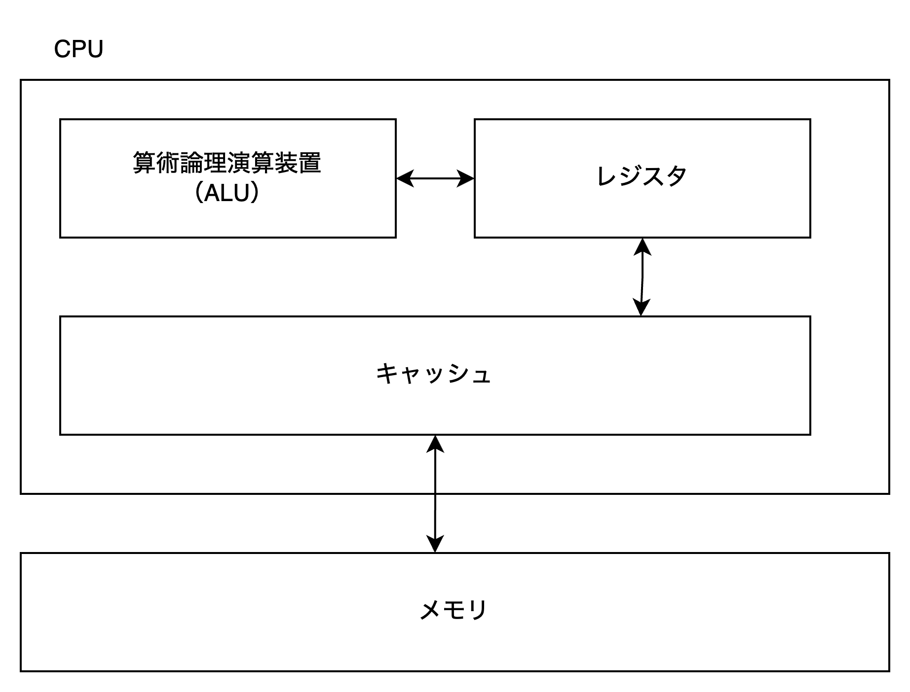

# コーディング時に知ってはおきたい CPU のキャッシュの特性

## Introduction

社長 > おーい、お前、そろそろ技術ブログ書いておいて。書かないと減給な。


> メロスは激怒した。必ず、かの邪智暴虐の社長を除かなければならぬと決意した。メロスには何を書けば良いのかがわからぬ。メロスは、村のエンジニアである。コードを書き、コンピュータと遊んで暮して来た。けれども減給に対しては、人一倍に敏感であった。


ということがあったかどうかは定かではありませんが、私はチキンですので、戦うことはせずに減給されないために何かしらのテックブログを書きたいと思います。せめてもの社長への抵抗として、実務的にはあまり役にたたない知識を techblog として記したいと思います。

さて、私は正式にコンピューターサイエンスという学問を学んだことがありません。日頃から業務に当たる上で、コンピューターサイエンスを学んでおかないといけない痛感させられることがありました。大量データを処理するのに適切なシステムデザインや高速化のためのパフォーマンスチューニングは無理であるからです。そのため、ゼロからコンピューターサイエンスを学んでいる最中です。

中でも CPUの構造がアプリケーションレイヤーに出てくる点が今まで経験したことがないが、物理レベルのアーキテクチャの設計思想がアプリケーションレイヤーに及ぶことがありうると聞いて衝撃を受けたことがあります。これがありうる例となぜそうなるのかを話したいと思います。

## 同じように見えて挙動が異なるコード

### 問題

突然ですが、この二つのコード配列のアクセスが違いますが、どちらも同じ速度で動くと思いますか？

```rust
fn main() {
    let mut array1 = vec![vec![1; 10000]; 10000];
    let array2 = vec![vec![2; 10000]; 10000];
    for j in 0..10000 {
        for i in 0..10000 {
            array1[j][i] = array2[j][i];
        }
    }
}
```

```rust
fn main() {
    let mut array1 = vec![vec![1; 10000]; 10000];
    let array2 = vec![vec![2; 10000]; 10000];
    for i in 0..10000 {
        for j in 0..10000 {
            array1[j][i] = array2[j][i];
        }
    }
}
```

これらのコードは for 内で配列を array2 から array1 に値を移行しています。これらの違いは配列へのアクセスの違いです。具体的には、二重配列の外側から最初にアップデートするのか、それとも内側からアップデートするかの違いです。検証のために実際に動かしてみましょう。便宜上、上記のコードのうち、上のものを former, 下のものを latter とします。

``` sh
> time ./target/debug/former
./target/debug/former  9.25s user 0.36s system 99% cpu 9.620 total
```


```sh
> time ./target/debug/latter
./target/debug/latter  32.37s user 0.49s system 99% cpu 32.865 total
```

と、結果をみると3倍以上差が出ていることに驚くと思います。これはなぜ発生するのでしょうか？ これは実は CPU のキャッシュに由来しています。

注. 今回検証に用いている CPU は Apple Silicon の M2 Pro ですが、別の CPU、例えば x86-64 の CPU でも発生しえます。

## CPU

### CPU の構造のざっくりとした説明


図1. CPU のおおまかな説明。本来はもっと制御する装置がありますが、今回の該当箇所のみに絞っています。

CPU には値を計算するユニット（ALU）とそのメモリ領域（レジスタ）が存在します。そして、ALU は具体的な処理を行う際に、対象となるレジスタを参照することになります。例えば、下記のようなアセンブリがあったとします。

```
add v1, v2, v3
```

この場合は、v2 と v3 のレジスタの値を加算して、その結果を v1 のレジスタに値を格納するという ARM64 のマシン語です。もちろん、この計算をするためにはあらかじめ v2 と v3 にあらかじめデータが格納されている必要があります。そのためのデータはメモリにあるので、CPU はメモリからデータを取得することになります。


### CPU のキャッシュ

先述の通り、CPU は必要なデータがあるたびにメモリをデータを読み込みにいきます。ただし、CPU からメモリは非常に遠くに存在する上に、メモリの速度よりも CPU の速度の方が圧倒的に速いため、毎回メモリに値をアクセスすると非常に遅くなってしまいます。これら CPU 内のキャッシュ（L1, L2, L3）とメモリ、さらにはストレージの速度差、そしてわかりやすくするための速度比を下記の表に記しています。

表1. 各オペレーションごとのレイテンシとその比較
| オペレーション | レイテンシ | 比較（1 CPUサイクルを 1s とした場合） |
| :--- | :--- | :--- |
| 1 CPU サイクル | 0.3ns | 1s |
| L1 キャッシュアクセス | 0.9ns | 3s |
| L2 キャッシュアクセス | 3ns | 10s |
| L3 キャッシュアクセス | 10ns | 33s |
| メインメモリアクセス | 100ns | 6m |
| SSD アクセス | 10-100μs | 9-90h |
| HDD アクセス | 1-10ms | 1-12 month |

非常に驚くべきことなのですが、CPU の世界から見ると、メモリからデータを取得するより桁違いに遅いということがわかっていただけたと思います。つまり、毎回メモリからデータを取得してくると、メモリアクセスの時間が相当なボトルネックとなっているために、いくらクロックを高めても CPU の速度は早くなりません。そのため、なるべく CPU 側から見て近い場所にキャッシュを蓄えておき、なるべくメモリにアクセスすることがないように工夫がなされています。その工夫の一つとして、取得するメモリの近辺にあるデータが選ばれることがあります。
こうすることで、なるべく計算の待ち時間を減らし高速に稼働するように CPU の設計がなされています。


## 先ほどの例の何が問題であるのか？

先ほどの例では、二重配列の内側の配列を更新する方法と、それとも二重配列の内側のポインタを固定させて外側の配列を動かす方法で速度計測をしました。その結果、後者の方が前者と比較し3倍以上の時間がかかっていたことを確認しました。
これは、CPU はキャッシュを取得する際に対象メモリの近隣のデータを取得する工夫に由来しています。つまり、データを取得する際に、配列のデータをキャッシュに格納します。そのため同じ配列を何度も用いた方が CPU にキャッシュがある確率（ヒット率）が高まり、高速に稼働することになります。逆に、異なる配列を毎回用いる場合は、CPU のキャッシュヒット率が下がり、メモリからデータを読み込むレイテンシが出てしまうために、遅くなってしまいます。

```rust
fn main() {
    let mut array1 = vec![vec![1; 10000]; 10000];
    let array2 = vec![vec![2; 10000]; 10000];
    for i in 0..10000 {
        for j in 0..10000 {
            // 計算のために二重配列のデータをキャッシュするが、内側が優先的にキャッシュされる。
            // 結果、キャッシュのヒット率が悪いためにメモリ参照をしにいかなければならないため遅くなる。
            array1[j][i] = array2[j][i];
        }
    }
}
```

さて、なぜこれが実務的にはあまり役に立たないかというと、人の直感に従うように通常コンパイラは最適化されているものだからです。つまり、普通のエンジニアであれば配列の内側から更新をするのが一般的です。これに反する稀有なことをすると遅くなります。もちろん、このような CPU の構造が持つ特性はパフォーマンスチューニングをする時にはもちろん必要になりますが、ソフトウェアエンジニア全員が知っておくべき知識でもないとは思います。

## まとめ

- 配列やデータアクセスではなるべく近い場所のデータを用いるようにしよう（特に配列）
- **ただし、普通に書けばこういうことは起きないはず**


## 参考文献

- Comer, D.E., & 吉川 邦夫. (2020). コンピュータアーキテクチャのエッセンス[第2版]. 翔泳社.
- Gregg, B., 西脇 靖紘 (監修), & 長尾 高弘 (翻訳). (2023). 詳解 システム・パフォーマンス 第2版. オライリー・ジャパン.
