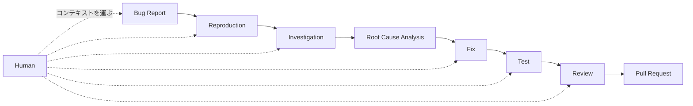
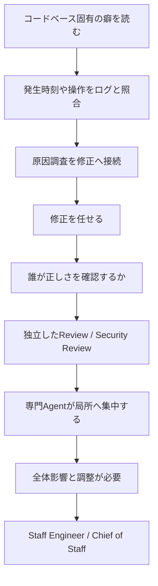
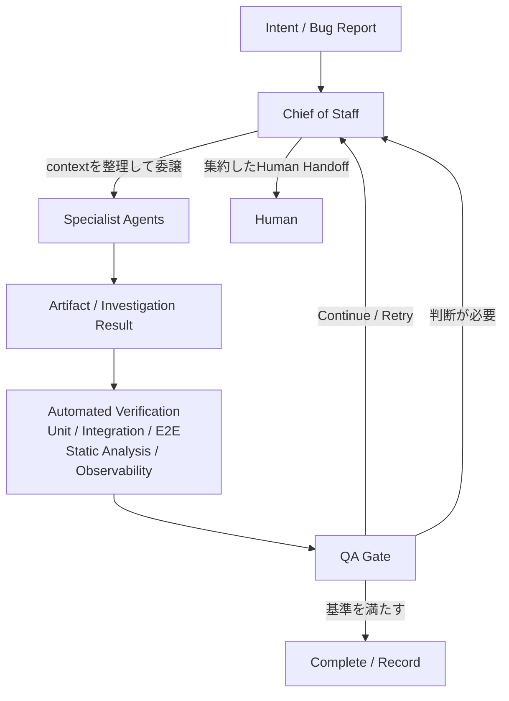

# 一つのbug対応を伸ばしたら、Software Factoryになった

_Grok Botを約3日間使って分かったこと、そしてCursor Projectsが出た_

最初の目的は、日々のbug対応でもう少し長い範囲をAgentへ任せることだった。Software Factoryや仮想の開発組織は、後からついてきた。

私は先に、Cursorを実際の開発で使い続けていた。リポジトリと必要な情報を渡すと、既存コードの調査、原因の追跡、修正、テスト、失敗への対応まで進めてくれる。自分で進めるより速く、安心して任せられる場面が増えていた。

実装をここまで任せられるなら、その前にあるbug investigationも接続できないかと考えた。

約3日後、関心はAgentの能力から、検証と人間の注意力へ移っていた。Software Factoryは、Agentを何体並べるかの話ではなかった。一つのワークフローを端から端まで動かすと、責任の分離や人間への引き継ぎまで設計対象になった。

この記事で扱うのは、約3日間の一事例である。長期運用の結果ではない。実際に起きたことと、そこから次に必要だと考えた設計仮説を分けて書く。

[前回の記事](https://zenn.dev/kou2kkkt/articles/d52dca7e2a1872)では、Software Factoryを、要件、制約、生成方法、評価基準、修正手順を再利用可能にし、継続的に実行する仕組みとして考えた。今回は実際に動かそうとして、どこで詰まったかを記録する。

## 1. 出発点はGrok Botではなく、Cursorでのbug対応だった

従来のbug対応では、人間が複数の場所を行き来する。Bug Reportを読み、再現し、ログを調べ、原因を整理する。その調査結果をCursorへ渡し、修正後のテストとレビューを確認する。

この流れで、人間は調査者であると同時に、異なる道具のあいだでコンテキストを運ぶ中継点にもなっていた。

やりたかったのは、このワークフローから人間を消すことではない。各工程で毎回コンテキストを積み直し、次の道具へ渡す仕事を減らすことだった。人間は、機械的に確認できる中継作業より、原因の不確実性や変更の影響を判断する場面に集中した方がよい。

ただし、リポジトリの中だけを見てもbug investigationは完結しない。GitHub Issue、ブラウザ上のアプリケーション、ログ、observability（可観測性）、AWS、stagingなど、外部に証拠が散らばっている。複数のアプリやウェブサイトをまたいで作業できる[Grok Bot](https://x.ai/news/introducing-grok-bot)を使い、最初にBug Investigatorの役割を持たせた。

役割と境界は、ワークフローを一段伸ばすたびに現れた問題を分離した結果、後から増えていった。

## 2. ワークフローを伸ばすたび、別の問題が現れた

### 原因調査は、むしろAgentの強みだった

予想に反して、最初に詰まったのは原因調査ではなかった。私が試した範囲では、Grok Botはリポジトリをかなり深く理解して進めてくれた。

単にコードの構造を追うだけではない。長く触ってきた人なら分かる手垢どころか、シミまで拾うように、コードベース固有の癖や過去の判断を読み取る。そのうえで、発生時刻や操作とログを照合する。コードだけ、ログだけを見る調査よりも、両方を同じコンテキストで扱える分、むしろ強かった。

人間がコードを調べ、別の画面でログを探し、その結果を頭の中でつないでいた部分を、一つの調査として進められる。Bug Investigatorの結果は、修正を検討できるところまで届くことが多かった。だからこそ、問題は次の工程へ移った。

### 実装の後には、独立したレビューが必要になった

原因の候補が見つかれば、次はCursorなどへ修正を任せられる。すると今度は、「生成された修正が正しいことを誰が確認するのか」という問題が出る。

実装したAgent自身に「正しく直せたか」を尋ねても、独立した検証にはなりにくい。同じコンテキストと同じ思い込みを引き継いでいる可能性があるからだ。Reviewerには変更範囲、既存設計との整合、テストの不足を疑わせる。Security Engineerには、権限、入力、データ漏えいなど別の失敗を探させる。このような独立した役割が必要になった。

役割を増やしたかったのではない。一つのAgentに、原因を推定し、実装し、自分の実装を承認するところまで持たせると、誤りの発見経路が一つしか残らない。生成と評価を分けるために、見る角度を分離した。

### 専門化の副作用は、局所最適だった

専門Agentは、与えられた問題へ深く入れる。一方で、特定の症状へhyper-focus（過度に集中）しやすかった。局所的には筋の通った修正でも、変更範囲が広すぎたり、既存の境界を崩したり、別の部分へ複雑さを移したりすることがある。

Staff EngineerやArchitectには、個別の修正をシステム全体への影響から評価させる。さらに、複数の専門Agentへ何を渡し、返ってきた結果をどう統合するかという調整の問題も残った。この役割をChief of Staffへ持たせた。

専門Agentを増やすほど、この調整を人間が暗黙に引き受ける構造は苦しくなった。

図にすると計画通り役割を足したように見えるが、実際には逆である。前の工程で露出した失敗を次の境界で受け止めようとした結果、後からこの形になった。

### 次のbottleneckはVerification Throughputだった

この試行で特に大きかったのがQuality Assuranceである。AgentによってImplementation Throughputが上がると、次のbottleneckはVerification Throughputへ移った。確認が追いつかない。

そこで効いたのは、AIに特有の新しい検証技術というより、従来からあるSoftware Engineeringだった。unit test、integration test、E2E、static analysis、code review、security review、observabilityである。実装候補が速く増えるほど、正しさの条件を実行可能な形で書き、別の経路から確かめる基盤の価値が上がった。

QA EngineerというAgentを置いても、それだけでQuality Assuranceは成立しなかった。QA Agent自身が、アプリケーションの振る舞いを確認できる経路が必要になる。そのインターフェースになったのがE2Eである。

Implementation AgentとQA Agentが同じソースコードだけを読んでいては、独立した検証として弱い。片方が「実装は正しそうだ」と言い、もう片方も「レビュー上は正しそうだ」と答えるだけになりやすい。別の経路から振る舞いを確かめる必要があった。たとえば、ブラウザを操作するE2Eや、外部インターフェースを通るintegration testである。

この意味で、E2Eは回帰テストに加えて、**Agentがsoftwareの振る舞いを自分で確認するためのインターフェース**になった。

### AWS Serverlessでは、全部をローカルE2Eに閉じ込められなかった

一方、対象のシステムではAWS Serverlessを多く使っている。Lambda、Step Functions、EventBridge、IAMまで含めると、実環境をローカルで再現できる範囲は限られる。本番に近い振る舞いをすべてローカルで再現するのは難しかった。

ここで「全部をローカルで再現する」という目標は諦めた。代わりに、検証可能な範囲を分けた。

- ローカルのunit testやstatic analysisで確かめられるもの
- Agentがintegration testやE2Eで振る舞いを確かめられるもの
- AWS実環境でなければ確かめられないもの

重要だったのは、最後の領域があるからといって、人間へ「全部確認してください」と戻さないことだった。QA Engineerには、何を確認し、どのEvidenceがあり、どこがまだ確認できていないかを評価させる。人間へ渡すのは、そのVerification Gapと、そこで必要な判断である。

完全な再現環境がなくても、検証を全面的に諦める必要はない。検証済みの範囲と未検証の範囲を混ぜないことが、新しい設計課題になった。

### Human-in-the-Loopでは、人間が最後のqueueになった

検証できる範囲を分けても、未確認点や判断をその都度人間へ戻している限り、次は運用そのものが詰まった。

最初は、各Agentの出力を私がその都度確認するHuman-in-the-Loopに近い形で動かしていた。Agentへ仕事を頼む心理的な摩擦は、人へ頼むときより小さい。思いつくたびに「これも調べて」「これもレビューして」「これも直して」と渡せる。

複数のAgentは並列で動き、調査結果、レビュー、実装、通知を次々に返してくる。Agent側のthroughputは上がった。その一方で、人間側には、通知を読み、前のコンテキストを思い出し、結果の妥当性を確かめ、次の判断をし、別のAgentへ指示を出す仕事が集まった。

勤務時間が終わってもAgentは動く。退勤後も「結果だけ見よう」と画面を開き、また判断が生まれ、次の指示を出す。寝る前までその状態を繰り返し、頭を仕事から切り離せず、眠れなくなった。

これは働きすぎの武勇伝ではない。Agentの稼働時間に合わせて、人間の注意力まで増やせる前提で設計していた。その前提が失敗だった。

Agentは24時間動ける。しかしHuman Attentionは、24時間利用できる資源ではない。Agentのthroughputをそのまま人間へ接続すると、人間がqueueになる。

実装は速くなった。人間の一日は長くならなかった。

### QA Gateは、品質とHuman Attentionの両方を守る

ここからは、今回の失敗を受けて次の試行に置く設計仮説である。

運用を続けるには、すべてのAgentの出力を人間が確認する構造から、自動検証で解決できなかったものだけを人間へ上げる構造へ移す必要がある。Agentと人間のあいだに、QA GateとChief of Staffを置く。

QA Gateには二つの役割がある。一つは、必要なテストやレビューを満たした成果物だけを通すQuality Gateである。もう一つは、機械的に確認できたものを人間の逐次確認へ流さないHuman Attentionの境界である。

Chief of Staffは、あらゆる仕事をこなす万能Agentではない。各Agentの状態をそのまま転送せず、コンテキストと依存関係を把握して作業を委譲する。専門Agentの結果を統合し、次工程を判断する。人間へのHuman Handoffには、決める必要があること、Evidence、Verification Gap、影響範囲、推奨案をまとめる。

ここでは、すべての成果物を人間が承認する構造をHuman-in-the-Loopと呼ぶ。Factory全体を監督し、自動検証で扱えない例外だけを人間が判断する構造がHuman-on-the-Loopである。これは今回の運用上の呼び分けだ。

Human-on-the-Loopは、まだ設計仮説の段階にある。ただ、逐次確認の運用は続けられず、人間へ何を上げるかだけでなく、**何を上げないか**まで決める必要があると分かった。

## 3. そこへCursor Projectsが出た

一つのbug対応を長くしようとしただけだった。それぞれの工程で露出した問題に境界を置いていくと、気づけば自分でSoftware Factoryらしいものを組み立てていた。

そして、ちょうどそのタイミングで[Cursor Projectsが発表された](https://cursor.com/changelog/projects)。公式発表は2026年9月10日付で、発表時点ではbetaである。Coordinator Agentが仕事を計画して複数のAgentへ委譲し、完了した仕事を人間へ戻す。さらに、Project内でコンテキストを共有し、SlackやPull Requestなどを契機に継続的な仕事を始められると説明されている。

自分で役割と矢印を増やし、「これはもはやFactoryでは」と思い始めたところへ、名前までそのままのProjectsが出てきた。少しだけ、図を描くのが遅かった気もする。

ただし、まだCursor Projectsを実際のワークフローで試していない。現時点で並べられるのは、根拠の異なる情報だけである。

| 観点               | Grok Bot                                                                                  | Cursor Projects                                                                                 |
| ------------------ | ----------------------------------------------------------------------------------------- | ----------------------------------------------------------------------------------------------- |
| この記事での根拠   | 約3日間、実際のbug対応で試した経験                                                        | 2026年9月10日の公式発表                                                                         |
| 確認できたこと     | リポジトリ外の証拠を含む調査から工程を伸ばし、検証、調整、Human Attentionの問題を経験した | Coordinator Agentによる委譲、共有コンテキスト、外部イベントを契機にした継続実行が発表されている |
| まだ分からないこと | 長期運用でQA GateとHuman Handoffが機能するか                                              | 同じbug対応で、Verification Gapや通知の圧縮をどう扱えるか                                       |

今の比較は非対称である。自前の仕組みを作り続けるべきか、Cursor Projectsへ寄せるべきか、両者で扱う範囲を分けるべきかは、同じワークフローで試してから判断したい。

今回の約3日間で分かったのは、Software FactoryはAgentの数では決まらない、ということだった。一つのワークフローを自動化すると、責任の分離、検証、品質ゲート、可観測性が必要になった。Human Attentionの管理も欠かせない。

面白かったのは、その多くが新しい概念ではなかったことである。テスト、レビュー、可観測性、職務分離といった、従来のSoftware Engineeringが効いた。Agentを運用する側に、以前からある問題が別の形で現れたのである。

Software Engineerの役割がなくなるというより、設計対象がSoftwareそのものから、Softwareをつくるsystemまで広がり始めている。そのsystemにはAgentだけでなく、検証基盤と、有限な注意力を持つ人間も含まれる。

これは、約3日間の試行から言える範囲の結論である。次はCursor Projectsを実際に使い、同じbug対応をどこまで任せられ、どこに新しいGapが現れるのかを確かめたい。

---

## 参考資料

- SpaceXAI, [“Introducing Grok Bot”](https://x.ai/news/introducing-grok-bot), 2026年8月11日
- Cursor, [“Cursor Projects”](https://cursor.com/changelog/projects), 2026年9月10日
