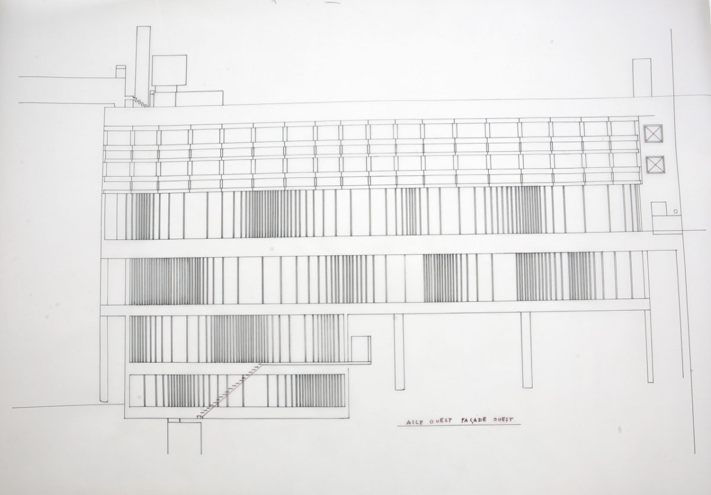
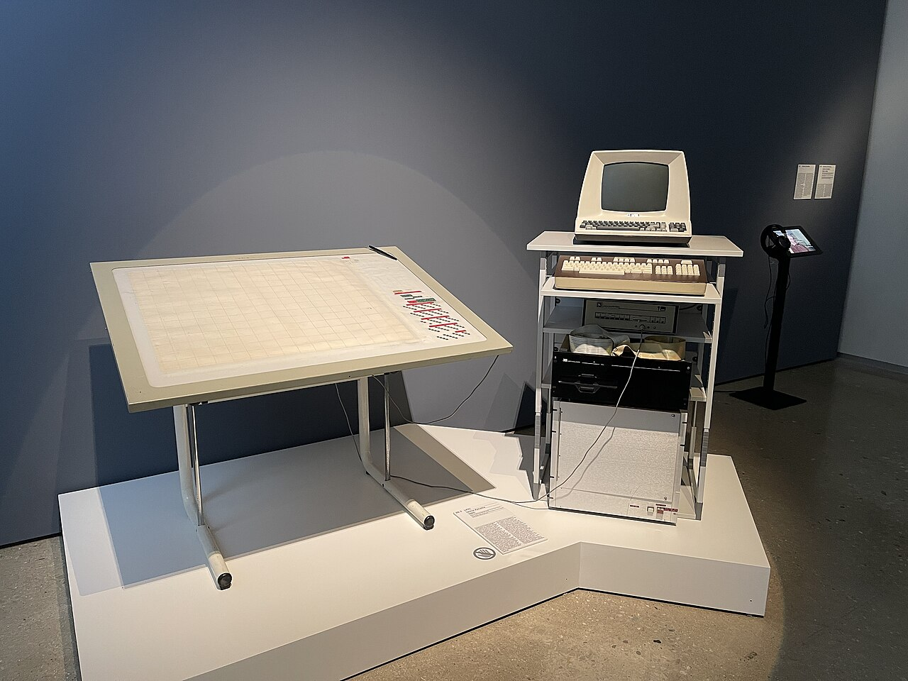

# 生成するルールと、選び抜く目

## XenakisからAI時代のエンジニアリングへ

一本の旋律を思い浮かべてほしい。

作曲家は音符を一つ置き、次の音符を置く。私たちが作曲に抱く素朴なイメージは、そういうものだ。

では、雨粒が屋根を打つ音はどうだろう。広場を埋める群衆のざわめきはどうか。そこでは、一つひとつの音を追っても全体はわからない。重要なのは、音がどれほど密集し、どの範囲に広がり、どんな速さで別の状態へ移るかである。

20世紀の作曲家・建築家Iannis Xenakisは、こうした「音の群れ」を作曲の対象にした。彼が設計したのは個々の音だけではない。音の群れが生まれ、変化する条件だった。

*Iannis Xenakis, 1975. Photo: The Friends of Xenakis / [Wikimedia Commons](https://commons.wikimedia.org/wiki/File:Iannis_Xenakis_1975.jpg), [CC BY 2.5](https://creativecommons.org/licenses/by/2.5/). 色調調整済みの公開版を無改変で掲載。*

この発想は、生成AIが文章や画像やコードの候補を大量に出す現在、いっそう身近に見える。しかし、Xenakisを「AIの予言者」に仕立てたいわけではない。彼は、現代的な生成設計につながる重要な源流の一人である。その実践を手がかりに、設計者の仕事がどこへ移りつつあるのかを考えたい。

私の主張は単純だ。生成的な仕事には、二つの異なる能力がいる。

一つは、結果を生む変数、制約、偶然性、環境をつくる「生成するルール」の設計。もう一つは、生まれた候補を比較し、採用するものを決め、必要ならルールを直す「選び抜く目」である。

## 偶然に任せるのではなく、偶然の形を決める

Xenakisの最初の主要作品とされる《Metastaseis》は、1953年から54年に作曲され、1955年に初演された。多数の弦楽器が別々のグリッサンド――音高を連続的に滑らせる奏法――を描き、個々の線が巨大な音の塊へ集まっていく。

ただし、《Metastaseis》を完成された「確率音楽」と呼ぶのは正確ではない。同作の中間部には音列の順列を扱う組合せ的な操作もあり、後の確率的手法を準備した転換点と見るほうがよい。確率論を明確に用いた展開は《Pithoprakta》（1955〜56）、さらに《Achorripsis》（1956〜57）へと続く。[Xenakis公式サイトの解説](https://www.iannis-xenakis.org/en/stochastic-music/)は、《Metastaseis》を最初の主要作品としつつ、自由確率音楽を1955〜57年の作品群に位置づけている。

ここでいう確率は、何でもよいからサイコロを振る、という意味ではない。

Xenakisは、音の発生頻度、持続、音域、強さ、グリッサンドの速度などを、確率分布や平均密度によって組織した。たとえば《Pithoprakta》では、多数のグリッサンドの速度を分布として扱い、《Achorripsis》では音響的な出来事を時間と音色のマトリクスへ配置した。局所では予測できない出来事が起きても、全体には狙った密度や輪郭が現れる。

偶然に任せたのではない。**どのような偶然が、どの範囲で起こりうるかを設計した**のである。

方法はそこで止まらない。自由確率音楽では、ある分布から出来事を生む。続くマルコフ連鎖を利用した作品では、次に現れる状態の確率が、直前の状態によって変わる。《Analogique A》《Analogique B》《Syrmos》がその例だ。

Xenakisは、音の雲を定義するだけでなく、ある雲が次の雲へどう移りうるかまでルールにした。この方法の展開からは、生成ルールそのものが発展した、と読める。最初に決めた方式をただ反復するのではなく、何が生まれるかを聴きながら、生成の仕組みを次の段階へ進めていったのである。

## 時間の密度を、空間の密度へ

同じ時期、Xenakisはル・コルビュジエのアトリエで、エンジニア、建築家として働いていた。

フランスのラ・トゥーレット修道院は1953年にル・コルビュジエへ委嘱され、1954年に着工した。全体の形はル・コルビュジエによる。一方、[Xenakis公式サイト](https://www.iannis-xenakis.org/en/couvent-sainte-marie-de-la-tourette/)によれば、Xenakisは中心的な協働者として内部構造と動線を具体化し、僧房、採光装置、ファサードなど複数の要素を担当した。

その仕事を象徴するのが、波状ガラス面（*pans de verre ondulatoires*）である。

*ラ・トゥーレット修道院、西側立面図。下層部では縦桟の密度が水平方向・垂直方向に変化している。画像引用: © Famille I. Xenakis / [Association Les Amis de Xenakis](https://www.iannis-xenakis.org/en/undulating-glass-panes/)。本図は波状ガラス面の構成を検討するため、必要な範囲で引用している。*

外壁では、ガラスを区切るコンクリートの縦桟が、均等ではない間隔で並ぶ。狭い間隔が密集したかと思うと、しだいに開き、また縮む。同じ部材の単調な反復でも、気分で散らした不規則でもない。構造と施工の条件を守りながら、光の入り方と立面のリズムに波が生まれる。[ル・コルビュジエ財団](https://www.fondationlecorbusier.fr/en/work-architecture/achievements-sainte-marie-de-la-tourette-monastery-eveux-france-1953-1960/)は、この波状面を両者が共同で設計したものと説明している。

設計過程はさらに興味深い。[Xenakis公式サイトの研究解説](https://www.iannis-xenakis.org/en/undulating-glass-panes/)によると、内庭側では、まず4種類の寸法を選び、その順番を入れ替える方法が使われた。《Metastaseis》中間部の順列操作と響き合う方法である。ところが外側のファサードで10種類を組み替えようとすると、候補は約300万通りに膨らんだ。

そこでXenakisは、問題の表現を変えた。

すべての並びを扱うのではなく、短い間隔が集まる高密度の部分と、長い間隔が続く低密度の部分をつくり、そのあいだをどう推移させるかを設計した。さらに、ファサード全体をモデュロールなどの比例尺度に基づく区画へ分け、使える「波」の型を表にした。個別の配置を描き切る代わりに、他の設計者も使える生成規則へ形式化したのである。

音楽では、時間のなかに音の密度と間隔を配置する。建築では、空間のなかに光と桟の間隔を配置する。ここには確かな類似がある。

ただし、「音楽で発明した方法を、後から建築へ応用した」という物語にしてはいけない。《Metastaseis》の作曲とラ・トゥーレットの設計は時期的に重なる。

研究者Elisavet Kiourtsoglouが紹介するように、音楽が建築を変えただけでなく、工学の数学、建築図、数学理論の図示もまた、作曲の新しい地平を開いた。音楽、建築、数学のあいだを、一つの思考が往復していたと見るべきだろう。

これは史実の要約を越えた私の解釈だが、Xenakisの重要性は、特定の形を別分野へコピーしたことではない。異なる素材を「密度、間隔、遷移」という共通言語で考えた点にある。

## ルールはどのように変わってきたか

ここから現代へ橋を架けるために、生成ルールの変化を一つの見取り図にしてみよう。

これは厳密な単線的歴史ではない。古い方法が新しい方法に置き換えられたわけでもない。現在も、必要に応じてすべてが併用されている。

まず、**固定された規則**がある。「この要素を、この順序で反復する」という手順だ。

次に、**パラメータ化された規則**がある。幅、高さ、個数、角度などを変数にし、値を変えると同じ関係を保った形の家族が生まれる。

そこへ、**確率的な規則**が加わる。値を一つに決めず、起こりうる範囲や分布を指定する。

さらに現代のジェネラティブデザインでは、候補を多数つくり、強度、重量、動線、コストなどの目標に照らして評価し、その結果を次の生成へ返す。Autodeskの説明も、目標、制約、入力を定め、複数案を生成・評価し、条件を調整して反復する過程として[ジェネラティブデザイン](https://help.autodesk.com/cloudhelp/2022/ENU/Revit-Model/files/GUID-22FE8E72-E791-4093-9517-7FA61F371AA7.htm)を定義している。

そして生成AIでは、人間がすべての生成規則を読みやすい形で直接書くとは限らない。モデルは大量のデータから統計的な規則性を獲得し、それに基づいて文章、画像、音声、コードなどを生成する。これは、入力データの構造と特徴を模して派生的な内容をつくるモデル群だという[NISTの定義](https://csrc.nist.gov/glossary/term/generative_artificial_intelligence)とも整合する。

用語を短く分ければ、次のようになる。

- **アルゴリズミックデザイン**：明示的な手順で形をつくる
- **パラメトリックデザイン**：変数と関係を保ちながら形を変える
- **ジェネラティブデザイン**：目標と制約のもとで複数案を生成し、評価・探索する
- **生成AI**：データから学んだモデルによって新しい内容を合成する

境界は重なるが、何を人が明示し、何を機械が探索・学習するかが違う。

*Xenakisらが開発したUPIC。左のタブレットに描いた図形を音へ変換する。これは生成AIではないが、人が音符を書く代わりに、音を生む表現と環境を設計する方向をよく示している。Photo: 1904.CC / [Wikimedia Commons](https://commons.wikimedia.org/wiki/File:Xenakis_UPIC_system_global_view_1.jpg), [CC0](https://creativecommons.org/publicdomain/zero/1.0/). 無改変。*

## 完成形の外側を設計する

この見取り図から見えてくるのは、設計対象の拡張である。設計者はいま、完成形だけでなく、その外側にあるものを設計する。

- 何を変数にするか
- 何を制約し、何を禁止するか
- どこに偶然性や探索の余地を許すか
- 何を「良い結果」とみなすか
- 生成結果を誰が、どの証拠で評価するか
- 評価を受けてルールをどう更新するか

本稿では、この仕事を「メタデザイン」と呼びたい。メタデザインという語に唯一の定義があるわけではない。ここでは、完成品を直接設計する一段外側で、完成品が生まれる条件を設計する、という限定した意味で使っている。

ただし、生成するルールを設計できれば十分なのではない。

計算機は、人間が一日で描ける数をはるかに超える候補を出せる。だが候補が増えるほど、選択は難しくなる。評価指標で一位になった案が、そのまま最良の案とも限らない。

移動距離を最小にした病院の平面が、患者の不安を減らすとは限らない。材料を最小にした部品が、修理しやすいとは限らない。クリック率を最大にした画面が、利用者にとって誠実だとも限らない。

評価可能なものだけを「良さ」と定義すれば、測れない価値は生成の外へ追い出される。

だから、目的、文脈、機能、美しさ、倫理、長期的な影響を見比べ、なぜこの案を採るのかを説明する力が必要になる。これが**選び抜く目**である。

それは生成以前からデザインの本質だった。生成ツールはデザイン能力を不要にするのではない。むしろ候補の量を増やすことで、判断の質を露出させる。何を良いと感じるかだけでなく、その判断を言葉にし、他者の異論や現実の結果によって更新できるかが問われる。

重要なのは、二つの能力を循環させることだ。

生成するルールが候補を生む。選び抜く目が候補を評価する。評価で見つかった欠陥が、変数、制約、評価方法を変える。完成形は、この往復の途中に現れる一時的な結論である。

## エンジニアもまた、条件を設計している

この構造は、ソフトウェアエンジニアリングにもそのまま現れる。

型やAPIは、単なる書式ではない。システムの利用者が何を表現でき、何を誤りとして拒まれるかを決める境界だ。よい型は望ましくない状態を表現しにくくし、よいAPIは安全な使い方を自然にする。これは、生成されうるプログラムの範囲を設計する仕事である。

ソフトウェアアーキテクチャは、変化と複雑性をどこへ閉じ込めるかを決める。すべてを予言するのではなく、変わりそうな部分に境界を置き、別の部分へ波及しにくくする。ここでも設計しているのは、単一の完成形より、将来の変更が起きうる条件である。

テストは、どの出力を正しいと判定するかの設計だ。テストを通ったという事実は、書かれた評価基準を満たしたことしか保証しない。抜けた条件や誤った期待値は、そのまま盲点になる。監視と運用は、現実の利用からその盲点を見つけ、設計へ戻すフィードバックループである。

コードレビューは、生成物を「選び抜く目」によって評価する場だ。動くかどうかだけでなく、意図が読み取れるか、変更に耐えるか、障害時に観測できるか、組織が保守できるかを見る。

AIによるコード生成は、この構造をはっきりさせる。

AIは実装候補を速く増やせる。だが、要件が曖昧なら曖昧なまま具体化し、テストが弱ければ誤りを通し、局所的にもっともらしいコードでもシステム全体の前提を壊しうる。

必要なのは、プロンプトの技巧だけではない。型、インターフェース、権限、テスト、観測可能性、レビュー基準を組み合わせ、望ましいコードが生まれやすく、誤りが発見されやすい環境をつくることだ。

「AIがコードを書くからエンジニアはいらない」という結論は、この仕事の半分しか見ていない。

重心は、実装そのものから、条件、制約、評価、検証、フィードバックループの設計へ動く可能性がある。ただし、実装を知らずにその外側だけを設計できるわけでもない。生成物の微妙な誤りを見抜き、現実的な制約を与えるには、コードとシステムへの深い理解が要る。手を動かす能力は消えるのではなく、判断の根拠になる。

## 仕事は、成果物から条件へ移る

同じ変化は、専門職の各所ですでに起きている。

医療では、診断候補を出す仕組みだけでなく、どの患者情報を集め、緊急度をどう判定し、機械の提案を誰が再確認し、結果をどう追跡するかを設計しなければならない。最後に必要なのは、目の前の患者の事情に照らして候補を選ぶ臨床判断である。

編集では、すべての文章を一から書く仕事に加え、企画が集まる入口、文体の指針、校閲の基準、読者からの反応を次号へ戻す仕組みをつくる仕事がある。文章の候補が安価に増えるほど、何を掲載し、何を削り、媒体として何を語らないかという編集の目が重くなる。

研究では、仮説だけでなく、実験条件、測定方法、除外基準、再現可能な手順を設計する。計算機が多数の仮説や分析を提案できても、反証可能な問いを選び、証拠の強さを評価し、都合のよい結果だけを拾わない規律は自動的には生まれない。

経営では、個別の指示を出すだけでなく、意思決定権、予算、評価指標、情報の流れを設計する。それらは組織行動を生成するルールになる。指標を置けば人はそれに適応するため、経営者には、数字の達成だけでなく、数字が生んだ副作用を見てルールを直す目が要る。

どの例でも、生成する仕組みと、価値を判断する仕事は分離できない。ルールだけでは、測定できるものへの過適合が起きる。目だけでは、判断が属人的になり、候補を生み続ける仕組みにならない。

Xenakisの波状ガラス面に戻ろう。

そこにあるのは、一枚ずつ気ままに置かれた窓ではない。かといって、数式が自動的に「正解」を吐き出した結果でもない。順列では扱いきれないと見て密度へ切り替え、採光、構造、比例、施工という条件のなかで波をつくり、その結果を人の目で選び、再利用できる規則へ整えた。

**生成するルールと、選び抜く目。**

その二つの往復に、現代の設計の核心がある。

人間の仕事がなくなるのではない。成果物を直接つくることから、成果物が生まれる条件を設計し、その価値を判断することへ、仕事の重心が移っているのである。

---

## 参考文献・資料

### Xenakisの音楽と建築

- Association Les Amis de Xenakis, [“Stochastic Music”](https://www.iannis-xenakis.org/en/stochastic-music/)
- Association Les Amis de Xenakis, [“Metastaseis”](https://www.iannis-xenakis.org/metastaseis/)
- Association Les Amis de Xenakis, [“Couvent Sainte-Marie de la Tourette”](https://www.iannis-xenakis.org/en/couvent-sainte-marie-de-la-tourette/)
- Elisavet Kiourtsoglou, [“Undulating Glass Panes”](https://www.iannis-xenakis.org/en/undulating-glass-panes/), *A Xenakis Dictionary*, 2023
- Fondation Le Corbusier, [“Sainte-Marie-de-la-Tourette Monastery”](https://www.fondationlecorbusier.fr/en/work-architecture/achievements-sainte-marie-de-la-tourette-monastery-eveux-france-1953-1960/)
- IRCAM, [“Biographie — Iannis Xenakis”](https://ressources.ircam.fr/en/composer/iannis-xenakis)
- Pablo Besada, [“Overcoming amnesia: on Xenakis's algebraic sources for musical theorization and composition”](https://www.tandfonline.com/doi/full/10.1080/17459737.2025.2465976), *Contemporary Music Review*, 2025
- Elisavet Kiourtsoglou, [*Le travail de l’analogie dans la musique et l’architecture de Iannis Xenakis*](https://theses.fr/2016PA080080), Université Paris 8, 2016

### 生成設計とメタデザイン

- Autodesk, [“About Generative Design”](https://help.autodesk.com/cloudhelp/2022/ENU/Revit-Model/files/GUID-22FE8E72-E791-4093-9517-7FA61F371AA7.htm)
- NIST, [“generative artificial intelligence”](https://csrc.nist.gov/glossary/term/generative_artificial_intelligence)
- Elisa Giaccardi and Gerhard Fischer, [“Creativity and Evolution: A Metadesign Perspective”](https://l3d.colorado.edu/wp-content/uploads/2011/09/digital-creativity-2008.pdf), *Digital Creativity*, 2008

### 画像利用について

- Xenakisの肖像はCC BY 2.5、UPICの写真はCC0の条件に従って掲載した。
- ラ・トゥーレットの立面図は、本文の批評・検討対象そのものであり、出典と著作権者を明示して必要な範囲で引用した。掲載先の規約や利用形態によって別途許諾が必要になる場合は、公開前に権利者へ確認すること。
